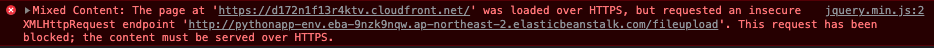
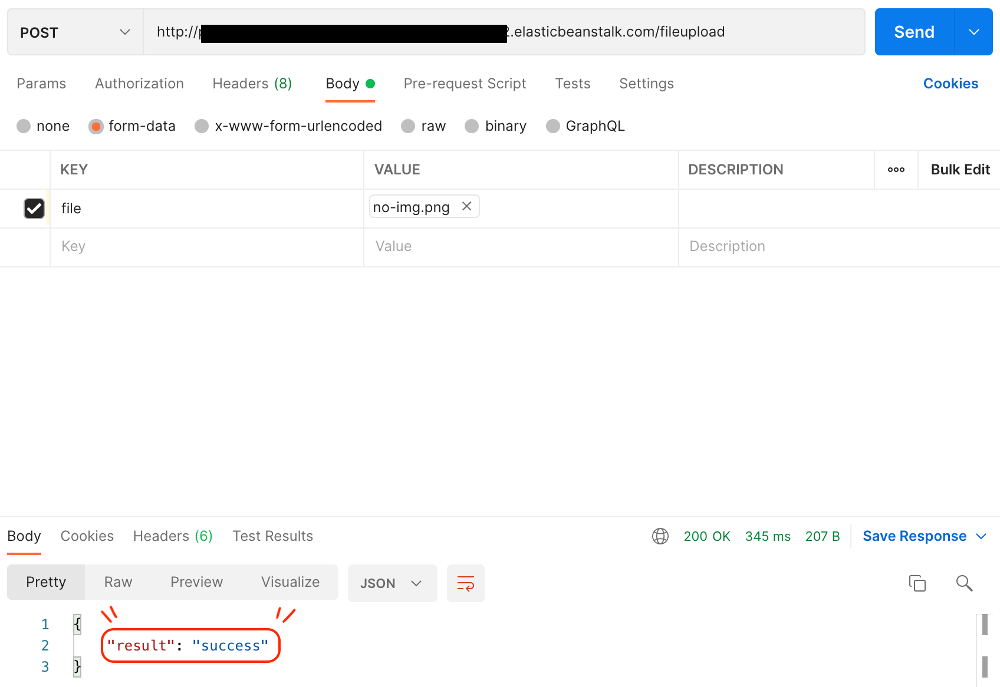
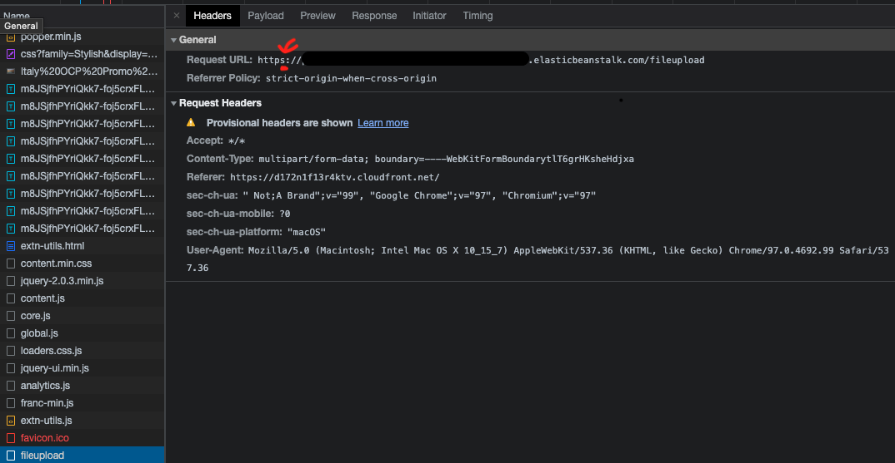
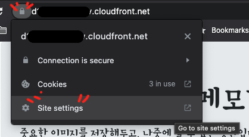
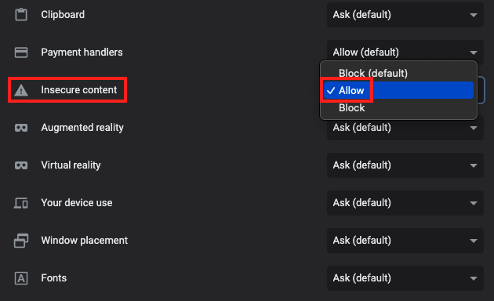
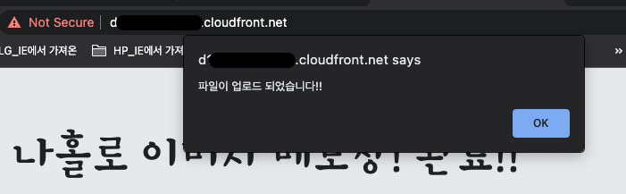

## 사건의 발단

강의를 보고 그대로 AWS CloudFront로 파일 업로드 페이지를 구축, AWS Elastic Beanstalk로 파일 저장 API 서버를 구축했다. 그런데 화면과 다르게 나는 파일 업로드가 잘 안됐다. 처음 의심이 된 것은 내가 프론트, 백엔드 서버를 잘못 구축했나 싶었다. (AWS는 처음이라..) 그리고 크롬 개발자도구를 열어보고 콘솔창에 이러한 에러 메시지를 보았다.


## 혼돈의 시작

에러 메시지로 구글링 하니 관련 글이 나온다. 그 중 [`앤테바`님의 블로그](https://wellsw.tistory.com/34) 글을 보았다. 해당 글의 시작은 이러했다 `https 사이트에서 ajax를 사용해서 비동기로 http 사이트에 request를 요청해서 문제가 발생 했습니다.` https 사이트에서 라는 말 외에는 모든 상황이 나랑 동일했다. 그리고 CloudFront 페이지를 보니 '자물쇠가 채워져 있었다'.  
  
완벽히 나와 동일한 문제라고 생각했다. 그리고 그 솔루션은 html파일에 아래의 코드 한 줄을 추가하면 됐다.

```html
<meta http-equiv="Content-Security-Policy" content="upgrade-insecure-requests" />
```

다시 파일 업로드를 했다. 콘솔창에 아까와 같은 에러메시지는 없었다. 그러면 파일이 잘 업로드 된 후에 성공했다는 alert박스만 보이면 되는데, 그게 보이지 않았다. 나는 다른 방향으로 문제를 찾으려 했다.(콘솔에 에러가 뜨지 않았으니 위 문제는 해결이 되었다고 생각했다.) Beanstalk 서버에서는 파일을 받은 후, 서버 내에 저장하는 것이 아니라 AWS S3에 저장하게끔 되어 있었다. 나는 혹시 그 지점이 문제가 아닐까 싶었다. Secret키 값이 잘못되거나, 로드밸런서가 일을 제대로 못하고 있거나 말이다. 어느 포인트에서 잘못됐는지 판단하기가 어렵기 때문에, 그 중 일부를 줄이기로 했다. 그 방법으로 Postman으로 파일 저장을 요청해보기로 했다. (CloudFront를 일단 빼자)

  
한 번에 성공했다. S3에서 확인해보니 파일도 잘 들어와 있었다. 그렇다면 문제는 CloudFront에서 Beanstalk로 요청 보내는 그 구간이라는 것을 알게 되었다.

## 다시 원점

분명 콘솔창에는 아무런 에러메시지가 나오지 않는다(favicon빼고). 크롬 개발자도구 네트워크 탭을 보기로 했다.  


분명 파일 저장 요청시 http로 요청을 하는데, 실제로 요청할 때 https 로 보내는 것이다. Postman으로 https로 보내니 똑같이 한참을 기다리다 `Error: Request timed out` 이라는 에러 메시지를 받는다. 이를 통해 나는 **http api 서버에 https로 요청하면 통신이 안된다는 것을 알게 되었고**, https페이지에서 http로 요청하면 https로 변하여 요청되는구나 라고 생각했다.(이건 잘못된 생각이다)  
한참이 지난 뒤에 알았지만 위에 html에 추가한 코드가 http 요청 시 https로 바꿔서 요청 해주는 코드였던 것이다. 나는 그것을 안 뒤 그 코드를 지우고 다시 원점으로 돌아왔다.

## 지식 공유의 힘

간절함이 통했나? [`현소프트`님의 글](https://hyunsoft.tistory.com/224)을 보게 되었다.  
글의 핵심을 얘기하자면, **크롬 86버전 부터 HTTPS 페이지에서 안전하지 않은 HTTP 리소스들을 불러 올 수 없다는 것이다.** 크롬 97버전을 사용하고 있는 나에게 HTTPS 페이지에서 HTTP로 요청할 수 있는 일은 애초에 할 수 없는 일이었던 것이다. `현소프트`님 아니었으면 오늘 잠을 못 잘 뻔했다(화나서). 정말 감사하다.

## 해결방법

- 같은 프로토콜끼리 통신하면 된다 (`http-http` or `https-https`)
- 임시로 크롬 사이트 설정에서 '안전하지 않은 컨텐츠'를 허용으로 두어 다른 프로토콜(`http-https`)끼리 통신을 가능하게 한다

나는 실제 서비스를 하려는 게 아니라 단순히 학습을 하기 위한 것이기에 2번 방법을 택했다. (빠르고 쉬움)

1. 먼저 크롬 주소창에 자물쇠를 눌러 설정 페이지로 간다
   

2. '안전하지 않은 컨텐츠(Insecure content)'를 허용(allow)으로 둔다
   

3. 크롬 새로고침(reload) 후 파일 저장 요청 시도 및 성공
   

## 마무리

- 지식을 공유해주시는 많은 분들께 정말 감사하다.
- 이제 집에 가자!

```toc

```
