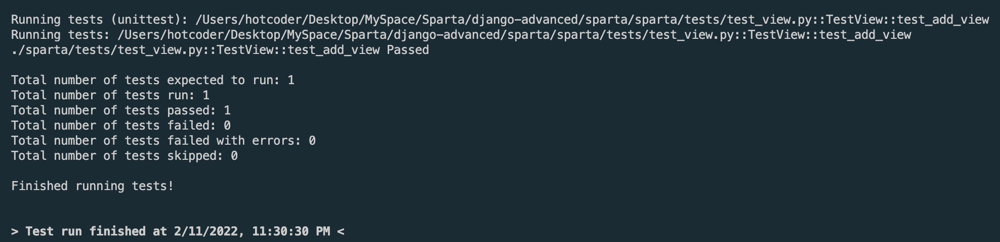

## Pycharm도 되는데 VScode는 안되나요?
오늘 수업시간에 Django에서 테스트코드를 작성하고 명령어 `$python manage.py test` 로 테스트 하는 법을 배웠다. 그리고 Pycharm에서 간단하게 설정 몇개를 하더니 단위(함수)별로 버튼 하나로 테스트와 디버깅이 가능한 것을 보았다. 내가 사용하고 있는 VScode에서도 동일한 방법으로 테스트를 하고 싶었다. 몇시간에 걸친 혈투 끝에 해답을 찾았다.

## VScode에서 Django 단위 테스트 해보자
### 환경 설정 ⚙️
1. vscode 왼쪽 탭에 플라스크 아이콘(Testing)을 누른다
2. 그리고 `Configure Python Tests` 버튼을 누른다 
   
3. `unittest`를 선택한다. (테스트 코드가 uniitest 방식으로 작성되어 있다)
   
4. 테스트 파일이 있는 경로를 설정 한다. 여기서는 Root(.)으로 하겠다
   
5. 테스트 파일명의 형식을 선택한다. 여기서는 `test*.py`를 선택하겠다. 테스트파일명은 test_view.py 이다
   
6. 위와 같이 설정파일 내용 선택을 마치면 `.vscode/settings.json` 파일이 생성되고 2번과 같이 내용이 작성된다
   
7. `{myapp}/tests/__init__.py` 에 2번 내용을 작성한다

```python
# 코드스니펫 '딸깍'
from django import setup
import os
os.environ.setdefault("DJANGO_SETTINGS_MODULE", "sparta.settings")
setup()
```      
8. `{myapp}/settings.py` 에 ALLOWED_HOSTS에 'testserver' 를 넣는다 ('*' all을 넣어도 괜찮다)


### 테스트 ⚖️
1. 좌측은 아까 플라스크(testing) 버튼을 누르면 보이는 창, 우측은 테스트코드.
   
2. 테스트코드 라인 5번째 줄에 보이는 초록색 재생 버튼을 누르면 해당 함수 안에 내용만 테스트하고 결과를 보여준다    
테스트 내용: 요청이 잘 되었는지(200), 응답값이 4가 맞는지 테스트 해본다
   
2-1. 실행결과: 테스트 통과!
   
3. 응답값을 변경해서 테스트 해본다
   
3-1. 에러 발생
   
3-2 에러 발생 이유 : 응답값(4)와 테스트값(5)이 같지 않다


### 디버그 🪲
1. 초록색 재생 버튼에서 우측 클릭 후 `Debug Test`를 누른다
   
 2. breakpoint를 찍어둔 7번째 줄에 걸리고 좌측 창에서 디버그 내용을 확인할 수 있다.


### 참고 📕
1. [(Youtube)Enable Unittest for Django Projects in VSCode](https://www.youtube.com/watch?v=7RaPq2BnPCI)
2. [(Stackoverflow)400 Bad Request While Using 'django.test.client'](https://stackoverflow.com/questions/28521949/400-bad-request-while-using-django-test-client)
3. [(Django docs)Testing tools](https://docs.djangoproject.com/en/4.0/topics/testing/tools/)
4. [(VScode docs)Python testing in Visual Studio Code](https://vscode-westeu.azurewebsites.net/docs/python/testing)

### 마무리
명령어로도 테스트가 가능하지만, 위에 세팅으로 VScode에서도 Django테스트를 더 편하고 강력하게 해보자!

```toc
```