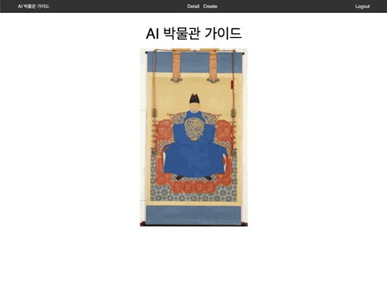
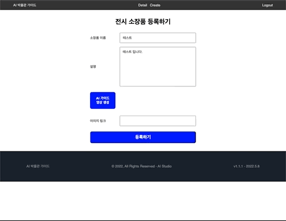
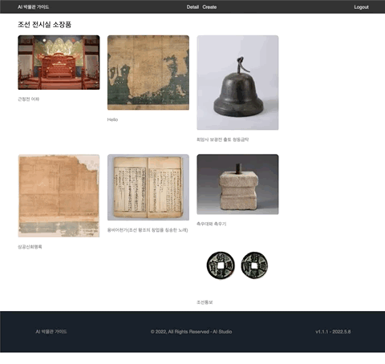

## 1. 딥브레인AI 아카데미 수료 및 프로젝트 완료 🥛

내배캠을 수료한 후 지난 5주간 딥브레인AI 아카데미에서 웹어플리케이션을 만들기 위한 여러 기술들을 배웠다. 매주 토요일에 풀타임(9:30-18:00)으로 진행되긴 했지만, 깊게 배우기에는 너무 짧은 시간이였다. [박물관 AI 가이드](https://github.com/brain-choihong/ai-museum-guide)는 `React`, `NextJS`와 딥브레인AI에서 제공한 `AI Studios API`를 활용한 프로젝트였다. 시간이 많지 않았기 때문에(같이하시는 분을 일하고 계시고, 나는 스파르타 공모전 프로젝트도 같이 진행했다) 완성도는 부족하지만 내게는 새로웠던 기술로 웹애플리케이션을 만들 수 있어서 재미있고, 뿌듯했다.

### 1-1 이번 프로젝트로 얻은 것

1. `NextJS` framework에서 웹애플리케이션 개발이 가능하다.
2. `React` 를 통해 컴포넌트를 만들고 화면 구성할 수 있다.
3. `Styled components`로 컴포넌트를 꾸밀 수 있다.
4. 비디오 제작 프로세스를 일정한 주기로 API 요청 및 확인하여 진행상황을 화면에 표시할 수 있다. (요청마다 프로세스 진행상황을 응답해주는 경우)

### 1-2 내가 작업한 부분 살펴보기

1. 소장품 리스트
   
   등록된 소장품들을 이미지와 함께 리스트업 하여 보여준다.

---

2. 소장품 등록 - AI 가이드 생성
   
   AI Studios api를 통하여 AI가이드(영상)를 생성한다. 3~4차례 API서버로 요청 및 응답을 하여 완성한다. 생성 진행상황은 1초 간격으로 api서버로 요청하여 받은 프로세스 결과값을 표시한다.

---

3. 소장품 수정, 삭제
   
   소장품을 수정, 삭제가 가능하도록 했다.

---

## 2. `AI 박물관 가이드` 프로젝트 KPT 회고록 🥜

- K (Keep) 잘하고 있는점. 계속 했으면 좋겠다 싶은 점
- P (Problem) 뭔가 문제가 있다 싶은 점. 변화가 필요한 점
- T (Try) 잘하고 있는 것을 더 잘하기 위해서, 문제가 있는 점을 해결하기 위해서 우리가 시도해 볼 것들

* **Keep**

  - React, NextJS로 웹개발이 가능함을 알았고, 많은 회사의 프론트엔드 포지션에서 해당 기술을 사용하는 것 같아, 잘 다루도록 숙련도를 올려야겠다.

* **Problem**

  - 함께하는 분과 소통을 많이 못해 아쉽다.
  - Git commit 메시지 컨벤션을 맞추지 못해 아쉽다.
  - 아카데미 과정에서 배운 Express 서버를 백엔드로 두지 못한 Serverless 프로젝트라 조금 아쉬웠다.
  - 로그인 인증 구현을 제대로 하지 못해 아쉽다.

* **Try**
  - 기능 정의와 화면 정의를 명확하게 하는 게 좋겠다. (짧고 작은 프로젝트라도..)

## 3. 총평 🍪

- 내배캠에서는 온라인으로만 수업을하고 프로젝트를 진행했었는데, 이번 아카데미는 매주 대면으로 교육을 받고 같이 프로젝트하는 팀원이랑도 대면으로 소통할 수 있어서 좋았던 것 같다. 물론 시간적인 측면(외출준비, 통학)에서는 온라인이 더 강점이 있지만, 역시나 사람들과 직접 부딪히며 교육받고, 프로젝트에 대해 대화를 나누는 것도 필요한 것 같다. 이 기간 동안에 배운 것들은 맛보기라 생각하고 계속해서 관련 기술들을 디벨롭하여 한 사람몫을 하는 `웹 개발자`로 성장 해야겠다. 비즈니스를 성공적으로 만드는 개발자 일 뿐 아니라 지식을 공유하는 개발자로 가는 여정은 이제 시작했을 뿐이다. 화이팅.

```toc

```
