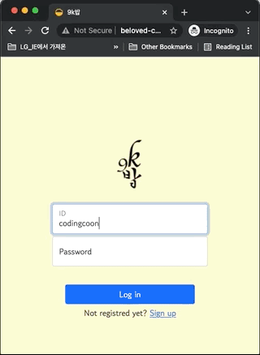

## 1. 드디어 9velopment의 첫번째 팀프로젝트를 마쳤다. 💪

아직 배운게 익숙하지 않고, 기간도 길지 않은 시간에 팀이 하나가 되어 아래의 필수 포함 사항을 잘 녹여 프로젝트를 잘 완성한 것 같다.

1. 기술 선택은 배운 내용 안에서 할 것
2. 기본 CRUD 포함
3. 로그인(JWT), 마이페이지(자기가 쓴 글) 포함
4. GIT 코드, 이슈, 프로젝트, 위키 기능 사용
5. AWS EC2 업로드 후 도메인 붙일 것

### 1-1. 결과물 🎬



## 2. 발표 이후 팀원들과 KPT회고를 진행하였다. ✍️

- K (Keep) 잘하고 있는점. 계속 했으면 좋겠다 싶은 점
- P (Problem) 뭔가 문제가 있다 싶은 점. 변화가 필요한 점
- T (Try) 잘하고 있는 것을 더 잘하기 위해서, 문제가 있는 점을 해결하기 위해서 우리가 시도해 볼 것들
  > 참고: https://techblog.woowahan.com/2677/

### 2-1. 9K밥 프로젝트 KPT 회고록 🍚

- **Keep**

  - 코드를 이해하고 응용 하려는 노력을 계속 하자!
  - 아침, 그리고 오후 미팅 하는게 너무 좋다 (점검)
    - 아침 - 오늘 할일 브리핑
  - Github을 잘 활용하여 협업이 잘 진행 되었다.
  - 역할 분담이 잘 되었다! (프론트2, 백엔드2, 팀장)
  - 기록 및 정리 하는 게 중요하다 느꼈다. 계속하자~
  - 문제가 생기면 팀안에서 같이 고민하고 해결하는게 정말 좋았다.
  - 팀장이 전체적인 흐름을 말씀해주셔서 좋았다. (진행상황을 잘 알 수 있었다)
  - 팀원 모두가 서로 존중하고 배려해서 트러블없이 프로젝트 잘 진행

- **Problem**

  - 화면, 디자인 부분을 먼저 프로젝트에 초기에 잘 잡아 놓고 개발 시작 했으면 좋겠다.
  - 현업에서는 어떻게 프로젝트 시작하는지(툴, 방법) 궁금하다.
  - 팀원간 실력차가 난다. 팀원에게 질문 하기가 두렵다. 마음의 변화가 필요!
  - Github 처음 써 봄. 충돌을 피하기 위해 테스트를 위한 파일을 활용하자
  - 어떤 기능에 대해서 프론트, 백엔드 어느 쪽에서 담당해야하는 지 몰라 혼란스러웠다.

- **Try**
  - 코드 리뷰 해 보고 싶다.
  - ERD 공부하여 프로젝트에 적용 해 보고 싶다.
  - 브라우저 고려한 개발을 시도(?) (`9k밥`은 크롬에 최적화, 다른 브라우저에서 실행 시 css 어그러짐)
  - 모바일, 데스크탑 두 버전도 다 개발 해 보고 싶다.
  - 설정파일 public repository에 올리지 않고 관리하는 방법 구현 해보고 싶다.

## 3. 총평 🌼

- 힘들었지만 결과물을 보니 그 고생이 다 날아간 것 같다. 재밌었다! 앞으로 더 많은 기술을 배워서 다양한 기능을 구현한다 생각하니 더욱 설렌다!
- 혼자가 아니라 함께하는 협업의 묘미를 맛 보았다 :)

```toc

```
