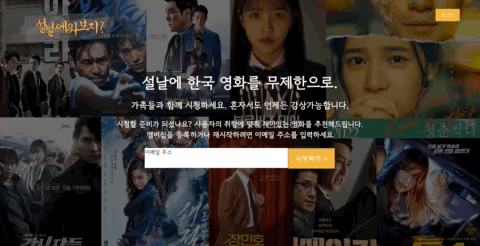
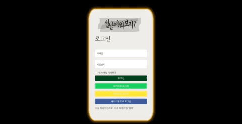

## 1. 코스인함시 첫번째 팀프로젝트 완료! 🤸
`코딩하긴했었나요-스쳐지나가는-인연이었나요-함께했던-시간들이-자꾸-삼(3)조` 이하 **코스인함시** 의 첫번째 팀프로젝트 [`설날에 뭐보지?`](https://github.com/joong8812/3team_netflix_clonecoding_project)를 마쳤다. 세계적인 스트리밍 서비스 중 하나인 `넷플릭스`의 외모와 주요기능들을 클론하고 프로젝트를 진행하면서 배우게 된 `추천시스템`을 적용해야하는 것이 주요 챌린지였다. 우선 `필수 포함 사항`을 살펴보자.
1. Django / Tensorflow 를 사용해주세요.
2. AWS S3 / RDS 를 사용해주세요. (사이트 구현에 필요한 이미지 등은 모두 S3 에 올린 것을 사용하는 방식으로 하셔야 하고, DB도 RDS 서버를 이용하셔야 합니다.)   
    ㄴ현업에서 아주 많이 사용되는 방식!
1. 로그인 / 회원가입 기능을 구현해주세요.
2. 추천시스템을 활용해주세요.
    (코사인 유사도만 사용하셔도 괜찮습니다.)
3. 넷플릭스와 비슷한 UI를 가지도록 만들되, 내부 콘텐츠는 팀에서 자유롭게 선정해주세요.   
    (뉴스 기사 추천 사이트를 만들어도 좋고, 유튜브 영상을 추천하는 사이트를 만드셔도 좋습니다.)
4. 넷플릭스처럼 사용자에 따라서 메인에 정렬되는 콘텐츠가 달라지도록 구현해주세요.
    (뉴스 기사 추천 사이트라면, 특정 사용자가 IT 기사를 많이 볼 경우 해당 이용 기록에 따라 기사 콘텐츠가 다시 정렬되도록 구현하시면 됩니다.)   
요구사항을 모두 잘 포함시켰다고 생각했는데, 지금 보니 Tensorflow를 사용하지 않았다. 헉😭 추천시스템을 위해서 sckikit-learn과 surprise 라이브러리만 사용했다. 아쉽다. 조금 변명을 하자면 추천시스템에 많은 시간을 쓰지 못했다. 왜 그런지 모르겠지만 시간이 매우 부족하다 느낀 이번 프로젝트였다.

### 1-1 결과물 🛼
1. 랜딩페이지
처음 페이지에 접속하고 프로젝터를 클릭을 하면 3초 뒤 랜딩페이지를 볼 수 있다.

___
2. 회원가입
랜딩페이지 -> 로그인 -> 회원가입 버튼을 누르면 회원가입 페이지를 볼 수 있다.

___
3. 로그인 & 장르 선택 페이지
처음 가입한 유저가 로그인 하게 되면 선호하는 영화 3개를 선택하는 장르 선택 페이지를 볼 수 있다.

___
4. 네이버 로그인
이미 선호 장르를 선택한 네이버아이디로 로그인 할 경우 바로 메인 페이지를 볼 수 있다.

___
5. 카카오 로그인
기존에 등록된 이메일로 소셜로그인 시도 시, 이메일 확인 안내 메시지를 볼 수 있다.

___
6. 페이스북 로그인
선호 장르를 선택하지 않은 페이스북아이디로 로그인 할 경우 장르 선택 페이지를 볼 수 있다.

___
7. 메인 페이지
넷플릭스와 같이 자동 재생이 되는 메인 페이지와 추천된 영화 목록을 볼 수 있다.

___
8. 영화 썸네일
추천 된 영화들도 마우스오버가 되면 영상이 재생 된다.

___
9. 영화 정보
썸네일 영화를 클릭하면 자세한 정보를 볼 수 있다.

___
9. 음성인식 명대사 검색
검색 버튼을 누르고 실미도 명대사 중 하나 `날 쏘고 가라`를 음성 인식 했을 때 실미도 검색결과를 볼 수 있다.

___

## 2. `설날에 뭐보지?` 프로젝트 KPT 회고록 ✍️
* K (Keep) 잘하고 있는점. 계속 했으면 좋겠다 싶은 점
* P (Problem) 뭔가 문제가 있다 싶은 점. 변화가 필요한 점
* T (Try) 잘하고 있는 것을 더 잘하기 위해서, 문제가 있는 점을 해결하기 위해서 우리가 시도해 볼 것들

- **Keep**
    * 하루에 2번 회의하는것
    * 서로 배려하고 잘 만들었다
    * 자유로운 식사시간
    * 책임감있게 자신의 일은 끝까지 마침
    * Github PullRequest를 잘 하였다
    * 게더 타운의 서버 불안정으로 디스코드 이용

- **Problem**
    * 협업 툴(Notion, Figma)을 잘 횔용하지못함(초반에는 잘 사용했으나 후반에는 사용 미흡)
    * 머신러닝에 완전 집중하지 못했다

- **Try**
    * 모르는것에 대해서 스터디를 진행(협업툴, 공통으로 쓰는 코드등)
    * 완전히 담당을 나눠서 한다 

## 3. 총평 ⛵️
* 뜨거웠던 2주가 끝이 났다. 이번 프로젝트 중에 새롭게 한 것들이 많았다. 소셜로그인, 데이터크롤링, 추천시스템 모델 만들기, 영상 임베딩 등이다. 정해진 기간 안에 해야기 때문에 구현 하는 것에 급급했던 게 조금 아쉽다. 특히 추천시스템을 만들 때, 조금 더 심도있게 이해를 하고 다양한 실험을 통해 좋은 추천 모델을 만들었으면 좋았겠으나 다른 기능 구현에 시간을 많이 쏟아 그러지 못했던 게 아쉽다. 또 모델을 통해 결과값을 받을 때까지 꽤 시간이 소요하게 되어 메인 페이지가 늦게 뜨는 점이 마음을 아프게 한다. 시간이 허락된다면 이후에도 해당 부분들을 공부하고 개선하고 싶다.
* `코스인함시` 팀원들과 이번 프로젝트를 같이 하면서 서로 더 알게 되고 가까워진 것 같아 기분이 좋다. 한마음으로 팀장님이 발표할 때 심장이 쿵쾅했던 때가 생각이 난다. 다음 프로젝트도 욕심이 난다!
* 모르는 부분들이 많고, 실력이 부족해서 그런지 완성도를 위해서 시간이 더 필요하다는 생각이 계속 들었다. 다음 프로젝트를 위해서 학습기간 한 주를 어떻게 보내야 할 지 고민이 많다.
* 그래도 끝까지 열심히 한 나에게 고생했다고 한마디 해주고 싶다 😘

```toc
```