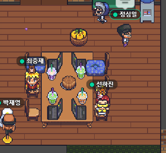

## 1. 코스인함시 두번째 팀프로젝트 완료! 🦚

우리 `코스인함시` 팀의 2번째 팀프로젝트 [미정의 스케치북](https://github.com/joong8812/project_3team_mijung_sketch_book)가 완료 되었다. Pretrained 된 유화제작 모델을 가지고 웹어플리케이션을 만들어 보았다. 이번 프로젝트의 필수 포함은 아래와 같다.

1. 인공지능 서버 / 앱 서버를 따로 구축해주세요. (Django, Flask, Django-Ninja 프레임워크 중 용도에 알맞은 프레임워크를 고민하셔서 구축해주세요. 다만 이전 프로젝트에서 아쉬웠던 부분은 개선하며, 한단계 성장한 개발자 다운 개발을 진행해 봅시다.)
2. 인공지능 서버 / 앱 서버 모두 AWS 를 통해 배포해주세요.
3. AWS S3 / RDS 를 사용해주세요.
4. 유화제작 인공지능 기술 (NST) 을 사용해서, 사용자가 이미지를 넣으면 유화 스타일이 적용된 이미지로 변환되어 출력되는 서비스를 만들어주세요.
   이번에 새롭게 도전되는 부분은 앱서버와 인공지능 서버를 2개 aws에 올려 어디서든 접속할 수 있는 어플리케이션을 만드는 것이였다. 학습기간에 새로 배웠던 Django-Ninja를 써야하는 점이 또한 챌린지였다. 나는 이번에 프론트엔드를 맡아 진행했는데, 해당 분야에 부족함을 많이 느껴서 공부가 많이 필요하다 느꼈다.

### 1-1 결과물 🕊

1. 로그인
   3개의 `소셜 로그인`을 구현하여 아이디, 패스워드를 입력하지 않고 편히 로그인할 수도 있게 하였다.
   

---

2. Lazy Loading
   많은 수의 이미지를 불러올 때 페이지가 늦게 뜰 수 있기 때문에 효과적으로 스크롤을 내릴 때마다 일정 수의 이미지가 로딩되도록 `Lazy Loading`을 구현해봤다.
   

---

3. 유화제작 페이지
   나만의 유화를 만들기 전 `스타일`을 적용시킬 명화를 선택한다.
   

---

4. 유화제작 성공
   추가한 이미지에 이전에 선택된 명화의 스타일을 입혀 새로운 유화를 제작한다. 해당페이지에서 바로 공유할 수도 있다.
   

---

5. 나의 유화 페이지
   내가 만든 유화들을 볼 수 있는 페이지. 다운로드, 공유하기, 삭제를 할 수 있다.
   

---

6. 공유 페이지
   내가 만든 유화들을 모두에게 보여 줄 수 있는 공유 페이지. 트위터, 페이스북으로 바로 공유 할 수도 있고, 복사된 url을 공유 할 수도 있다. 또 버튼을 통해서 다른 이용자들도 해당 서비스를 이용할 수 있도록 했다.
   

---

## 2. `미정의 스케치북` 프로젝트 KPT 회고록 ✍️

- K (Keep) 잘하고 있는점. 계속 했으면 좋겠다 싶은 점
- P (Problem) 뭔가 문제가 있다 싶은 점. 변화가 필요한 점
- T (Try) 잘하고 있는 것을 더 잘하기 위해서, 문제가 있는 점을 해결하기 위해서 우리가 시도해 볼 것들

* **Keep**

  - 하루에 2번 회의하는것
  - 서로 배려하고 잘 만들었다
  - 책임감있게 자신의 일은 끝까지 마침
  - 풀리퀘스트 안꼬이고 잘함
  - 게더 타운의 서버 불안정으로 디스코드 이용
  - 배포 후에 확인 작업하여 오류 수정한 것
  - 팀원들의 유대감

* **Problem**

  - 협업하는 툴을 잘 횔용하지못함(초반에는 잘 사용했으나 후반에는 사용 미흡)
  - 환경을 생각하여 구성(이번에 모바일 환경을 생각하며 했는데 실제 모바일에서는 잘 안됨)

* **Try**
  - 모르는것에 대해서 스터디를 진행(협업툴, 공통으로 쓰는 코드등)
  - 배포에 GitAction을 사용하여 자동화

## 3. 총평 🍄

- 이번 프로젝트는 직전 프로젝트와 다르게(그 때는 페이지 별) 크게 백엔드, 프론트, AI로 담당을 정해 진행했다. 나는 프론트를 해보고 싶어 자진해서 맡았는데 스스로 결과물이 만족스럽지 않았었다. 보여지는 부분에서 다른 사람들에게 많은 임팩트를 줄 수 있을 것 같다 생각을 해서 '내가 한 번 해보겠다' 라고 나섰는데 쉽지 않았다. 인터렉티브하고, 멋지게 만들고 싶었는데... 다른 조 분들은 어찌나 이쁘게 잘 만드시는지.. 하아. 제일 아쉬웠던 부분은 모바일 어플리케이션을 만들자라고 했는데, 실제 모바일환경에서는 제대로 동작을 안하는 것이였다. 마우스오버라 던지, 모달 각 요소의 위치가 데스크탑 브라우저에서만 잘 동작하게 되던지 말이다. 다음에는 페이지 크기뿐만 아니라 실제 모바일에서 잘 돌아가게끔 만들어야겠다.
- 함께 했던 3조 동료들에게 너무 감사의 말을 전하고 싶다. 서로 배려하면서 2개의 팀프로젝트를 잘 마친 것 같다. 앞으로도 승승장구 합시다!!

## 함께 했던 3조 식구들 많이 즐겁고 감사했습니다용!

