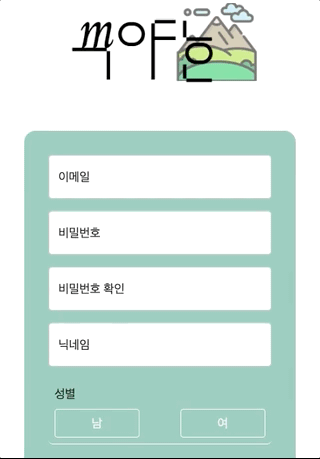
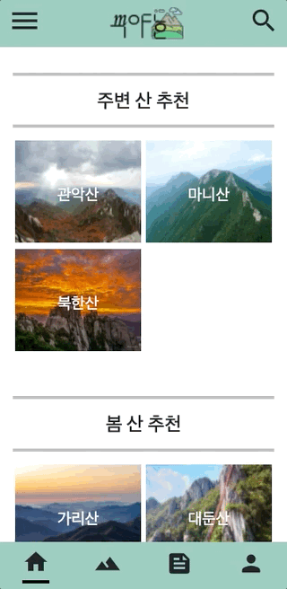
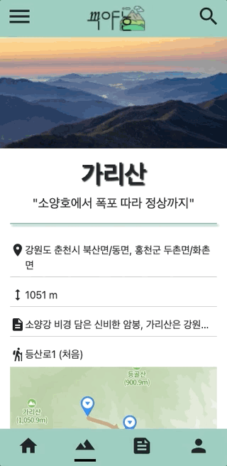
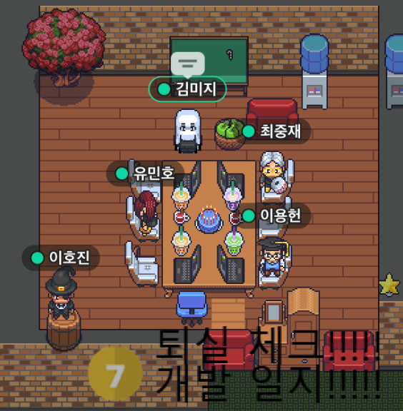

## 1. blank Final 팀프로젝트 완료! 🦚
우리 `blank` 팀의 처음이자 마지막 팀프로젝트 [무야호](https://github.com/joong8812/mooyaho)가 완료 되었다. 지금까지와 다르게 중간에 실제 유저들의 피드백을 받아 개선 시키는 기간도 있었다. 이를 통해 유저들의 생각도 엿볼 수 있었고, 완성도가 높은 프로젝트로 개선할 수가 있어서 좋은 경험이었다고 생각한다. 이번 프로젝트 때 새롭게 경험했던 것들을 나누고 싶다 :)

### 1-1 AWS의 다양한 서비스를 사용
1. `AWS Route 53`를 사용하여 가지고 있는 도메인을 등록하고 AWS EB와 연결을 해보았다. 
2. `AWS Certificate Manger` 로부터 SSL인증서를 받아 HTTPS 사이트로 구성할 수 있었다.
3. `AWS CodePipeline`을 우리 Github repository와 AWS EB 앱서버를 연결하여 자동 배포 할 수 있게 해 보았다.

### 1-2 프론트 개발 챌린지
1. 회원가입 유효성 체크

입력 필드에서 벗어나면 바로 유효성 체크를 하게 하였다. 이메일, 닉네임의 경우는 비동기로 서버 요청하여 중복체크도 하게 하였다. 중복체크는 서버 요청 및 응답을 함에도 빠르게 결과를 얻고 동작이 되어 하면서도 신기했다.
___
2. 이미지 로딩 spinner

이미지 로딩을 할 때 화면에 보이는 것만 로딩하는 `lazy loading`을 이미 적용한 상태였다. 그런데 로딩중이라는 상태를 보여주지 않으니까 유저 입장에서는 '이미지가 안 보이니 정상동작을 안한다' 라고 생각되어질 수 있다 생각했다. 그래서 로딩이 다 되지 않은 상태에서는 spinner를 보여주고 로딩이 되면 spinner를 안 보이게 해서 이 문제를 해결했다.
___
3. 등산로 구현

Naver map과 오픈공간정보플랫폼에서 제공하는 등산로 API를 통해 각 산의 등산로 코스를 보여주는 작업이였다. Naver map 사용법을 이해하는 데 시간이 좀 걸렸고, geojson형식의 등산로 데이터를 Naver map이 바로 그려주어서 조금은 편하게 구현할 수 있었다. 다만 등산로 데이터가 너무 쪼개어져 데이터가 오고 그걸 하나씩 보여주다 보니 유저들은 하나로 합쳐진 등산로가 보고 싶다는 피드백이 조금 있었다. 시간이 부족해 이 부분은 해결하지 못해 아쉽다.
___
4. 무한 스크롤

기존에는 전체 글 피드가 한 번에 모든 글을 응답해준 후 렌더링 하는 방식이였다. 테스트도 그렇고 실제 피드백을 받는 기간에도 글의 수가 많지가 않아 큰 문제는 없었지만, 향후에 글이 많아지면 이 방식은 100% 글을 렌더링하는 데 많은 시간이 걸릴 것이라 생각했다. 그래서 나는 백엔드쪽에 글 7개씩 페이지네이션 할 수 있도록 API를 만들어 두고 프론트에서는 페이지 단위로(7개 글) 로딩하여 렌더링 하도록 하였다.
___

## 2. `무야호` 프로젝트 KPT 회고록 ✍️
* K (Keep) 잘하고 있는점. 계속 했으면 좋겠다 싶은 점
* P (Problem) 뭔가 문제가 있다 싶은 점. 변화가 필요한 점
* T (Try) 잘하고 있는 것을 더 잘하기 위해서, 문제가 있는 점을 해결하기 위해서 우리가 시도해 볼 것들

- **Keep**
  - Github으로 코드 리뷰 좋았다. 서로 코드도 보고 더 좋은 코드로 바꿀 수 도 있고. 그리고 재밌었다.
  - 하루 오전, 오후 회의를 두번거치며 하루를 계획하고 되돌아보는 시간이어서 좋았다.
  - Github 이슈를 잘 활용해서 누구 현재 무슨 일을 하는 지 알기 좋았다. (일정관리에도 좋았다)
  - 일정 모두 잘 준수해서 발표날 까지 초기 계획한대로 잘 완성했다.
  - 피드백 적극 수용하여 프로젝트에 잘 입힌거 같다.작업하여 오류 수정한 것
  - CI/CD를 구현하여 배포를 자동화 하니 변경된 사항도 바로 반영하여 서비스할 수 있어 좋았다.

- **Problem**
  - 디자인에 신경을 많이 못 써서 조금 부족했던 게 아쉽다.
  - 유저가 재미있을 만한 요소 들에 대해서도 초기단계에서 논의를 했으나 반영을 못했다.
    - 경쟁, 날씨
  - 등산로 데이터로 효과적으로 보여주지 못해 아쉽다.
  - 피드백을 수용했으나 아직 필요한 기능들을 적용하지 못해서 아쉽다.
  - admin 페이지를 적극 활용하지 못해 아쉽다.
  - 테스트 주도 개발을 못해 본 게 아쉽다.
  - 로컬 db로 개발하는 방법을 늦게 알아 아쉽다.
  - 프로젝트 폴더, 파일 구조 팀내에서 정해서 했었으면 더 좋았겠다.

- **Try**
  - 테스트 주도 개발을 해 보고 싶다.
  - 웹 소켓같은 기술을 활용해서 채팅기능을 구현해보고 싶다.
  - github에서 PR을 처음부터 사용하여 코드리뷰를 더 적극적으로 해보고싶다.
  - 푸시알람 기능을 구현해보고싶다.
  - 인공지능을 더 공부하게 된다면 찍은 사진을 계절별로 NST한 기능을 넣었어도 좋았을것같다.

## 3. 총평 🖍
* 스파르타 내배캠에서 진행하는 팀프로젝트는 이제 막이 내렸다. 우리는 이제 이 곳에서 강의로, 프로젝트로 배운 것을 가지고 더 나은 개발자가 되어 어느 조직에 들어가 일을 할 것이다. 아직 배울 게 많고 갖춰야 할 역량이 많지만 정말 기대가 된다. Windows 응용 프로그램 개발자에서 웹 개발자라니 (요즘 프론트, 백엔드 개발자 고민중이다) 생각만 해도 신난다. 학습의 끈을 놓지하고 계속 개발자로써의 실력을 갖추면서 나도 좋고 그 곳에서도 나를 원하는 기업에서 일하고 싶다.
* 한 달이 넘는 프로젝트 동안 팀원들과 울고 웃으며 열심히 한 것 같다. 부족한 5명이 모여서 하나의 웹 서비스를 만들고 배포도 하고 피드백도 받아보고 정말 귀한 경험을 했다. 유저들의 목소리가 굉장히 중요함을 깨달았다. 그들은 우리가 보지 못했던 사각지대를 보았고, 우리보다 더 뛰어난 아이디어를 가지고 있으며, 더 좋은 UX/UI를 알고 있음을 알았다. 나의 개발 모토인 `유저 친화적 개발`을 잊지말고 더 정진해야겠다. Blank 팀원들 모두 고생하셨어요! 우리 좋은 곳으로 이제 일하러 갑시다!!
```toc
```

## 함께 했던 7조 blank 팀원들과 찰칵 📸
