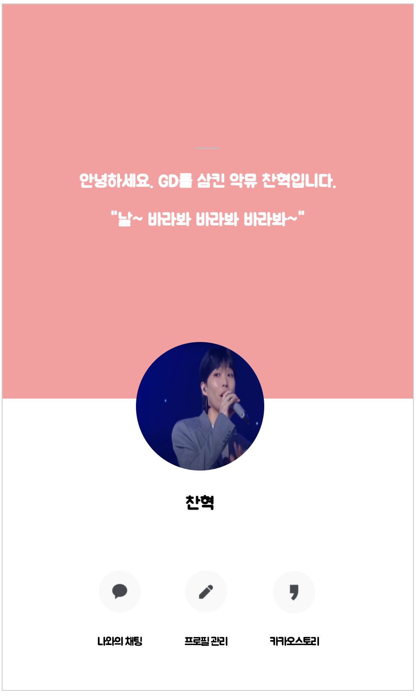

## 카카오톡 프로필 클론하기
### 1. 개요
대한민국에서 가장 많이 사용하는 메신저는 무엇일까? 나는 `카카오톡` 이라 생각한다. 친구 목록에서 친구들을 누르면 `프로필 정보`를 볼 수가 있다. 오늘은 그 페이지를 html과 css를 가지고 그대로 구현 해 보는 시간을 가졌다.

### 2. 구현
1️⃣ 처음 클론 하라는 이미지를 보았을 때 크게 세 부분으로 나누어야겠다 생각했다. 상단부(상태글), 중간부(프로필사진 및 이름), 하단부(3개의 버튼) 이렇게 말이다.   
2️⃣ 1번에서 언급한 세 div를 한 div에 담아 display:flex로 세로로 정렬 시켰다. 그 중 중간부(프로필 사진 및 이름) 부분은 위,아래 사이에 겹쳐서 있어야 했기에, position:absolute를 사용했다.   
3️⃣ 상단부 작은 회색 선(물체)은 button으로 구현했다. (튜터님을 통해 hr태그 있다는 걸 나중에 알았다.)    
4️⃣ 하단부 버튼 3개 역시 display:flex로 가로로 정렬   
5️⃣ (추가조건) em, rem, % 등 상대적 수치는 사용 불가, 오직 px로만 구현할 것   


### 3. 코드
```html
<!DOCTYPE html>
<html lang="en">
<head>
    <meta charset="UTF-8">

    <link href="https://fonts.googleapis.com/css2?family=Gaegu:wght@700&family=Jua&family=Song+Myung&display=swap" rel="stylesheet">

    <title>카카오 프로필</title>
    <style>
        * {
            font-family: 'Jua', sans-serif;
        }
        .whole-body{
            width: 480px;
            height: 800px;

            background-color: aquamarine;

            border: 1px solid rgb(206,206,206);

            display: flex;
            flex-direction: column;
            justify-content: center;
        }
        .profile-top{
            height: 460px;
            position: static;
            text-align: center;
            background-color: rgb(255, 155, 157);
        }
        .gray-box{
            background-color: rgb(208, 180, 180);
            border-radius: 10px;
            border: none;
            width:30px;
        }
        .profile-top > div {
            margin-top: 150px;
            color: white;
            font-weight: bold;
            font-size: 20px;
        }
        .profile-center{
            left: 165px;
            margin-top: 210px;
            position: absolute;
            text-align: center;
            font-weight: bold;
            font-size: 20px;
        }
        .profile-center > img {
            width: 150px;
            height: 150px;
            border-radius: 100px;
        }
        .profile-bottom{
            height: 340px;
            background-color: white;
        }
        .profile-bottom > div{
            margin-top: 200px;

            display: flex;
            flex-direction: row;
            justify-content: center;
            align-items: center;

        }
        .chat-myself {
            font-size: 13px;
            letter-spacing: -1px;

            display: flex;
            flex-direction: column;
            align-items: center;
        }
        .chat-image{
            background: url("chat_myself.png") no-repeat;
            background-size: 50px 50px;
            border: none;
            width: 50px;
            height: 50px;
            cursor: pointer;
            margin-bottom: 13px;
        }
        .manage-myprofile{
            font-size: 13px;
            letter-spacing: -1px;

            display: flex;
            flex-direction: column;
            align-items: center;
            margin: auto 50px auto 50px;
        }
        .mmp-image{
            background: url("manage_profile.png") no-repeat;
            background-size: 50px 50px;
            border: none;
            width: 50px;
            height: 50px;
            cursor: pointer;
            margin-bottom: 13px;
        }
        .kakaostory{
            font-size: 13px;
            letter-spacing: -1px;

            display: flex;
            flex-direction: column;
            align-items: center;
        }
        .ks-image{
            background: url("kakaostory.png") no-repeat;
            background-size: 50px 50px;
            border: none;
            width: 50px;
            height: 50px;
            cursor: pointer;
            margin-bottom: 13px;
        }
    </style>
</head>
<body>
    <div class="whole-body">
        <div class="profile-top">
            <div>
                <button class="gray-box"></button>
                <p>안녕하세요. GD를 삼킨 악뮤 찬혁입니다.</p>
                <p>"날~ 바라봐 바라봐 바라봐~"</p>
            </div>
        </div>
        <div class="profile-center">
            
            <p>찬혁</p>
        </div>
        <div class="profile-bottom">
            <div>
                <div class="chat-myself">
                    <input type="button" class="chat-image">
                    <p>나와의 채팅</p>
                </div>
                <div class="manage-myprofile">
                    <input type="button" class="mmp-image">
                    <p>프로필 관리</p>
                </div>
                <div class="kakaostory">
                    <input type="button" class="ks-image">
                    <p>카카오스토리</p>
                </div>
            </div>
        </div>
    </div>
</body>
</html>
```

### 4. 결과물


## 총평
* css 문법을 잘 알지 못하니까 계속 이것 저것 써보면서 하나 하나 구현했다. (시간이 많이 걸림) 풀스택 개발자로 가는 길은 너무나 멀고도 험하다.
* 하단부 버튼들 경우 같은 css를 적용 받게 되는데 같은 클래스로 묶어줘야 겠다는 생각을 못하고 각 각 따로 클래스를 부여했다. (시간 낭비, 반복적인 불필요한 코드 생성)
* 하단부 버튼들을 `<input type=button>` 으로 하니까 [html validator](https://validator.w3.org/) 에서 value값을 넣어야 한다고 지적을 당했다.
* 나는 오늘도 한걸음 걷는다.

```toc
```