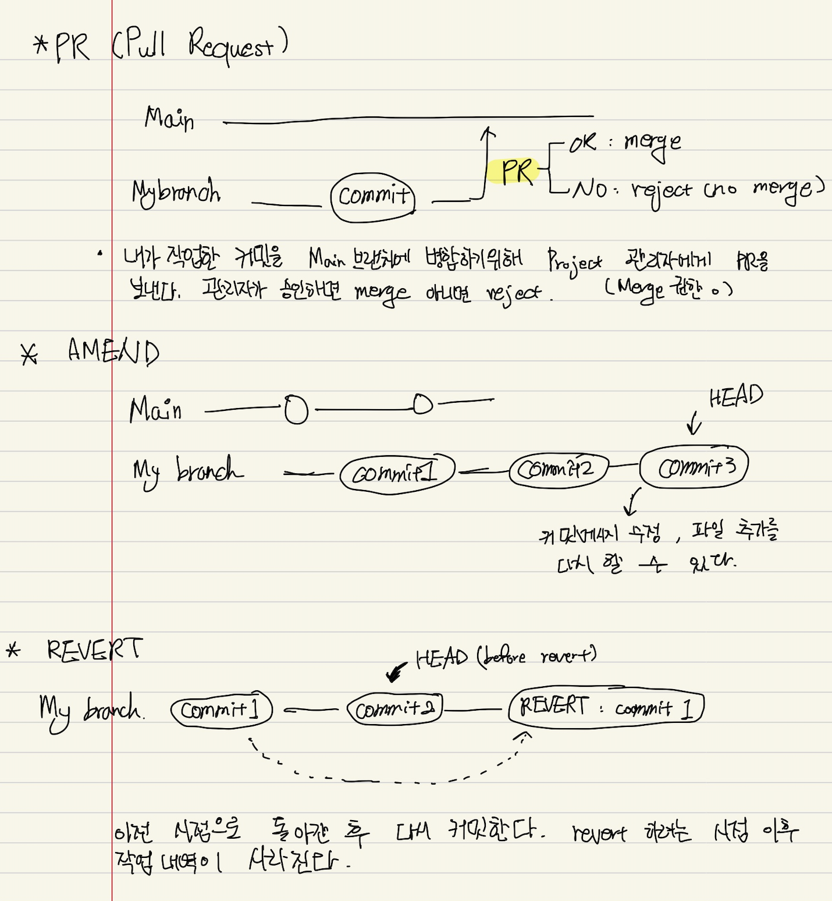
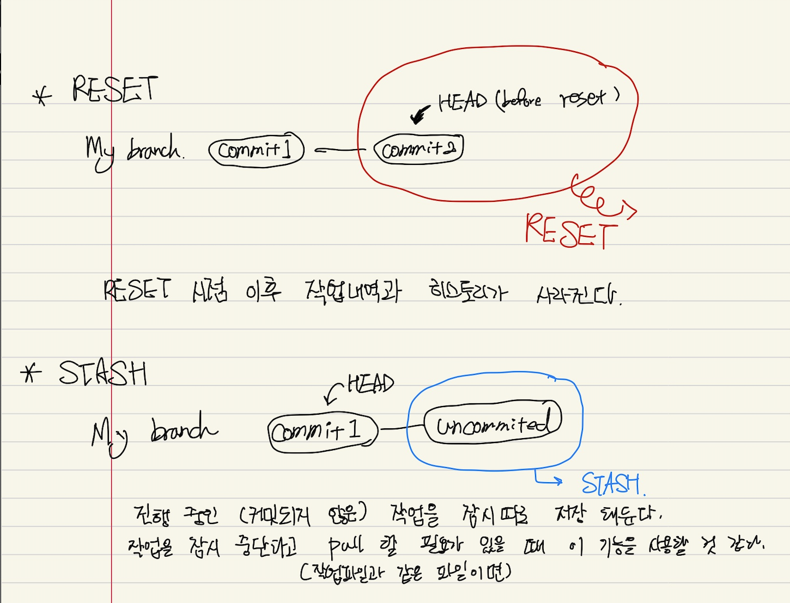

## 1. 내가 정리한 Git 3주차 개념지도
___

* PR, Amend, Revert
  * `PR(Pull Request)`: contributer가 자신의 작업(commit)을 PR 하면 프로젝트 관리자가 해당 commit을 main에 병합 할 지 말지를 결정한다. merge 요청.
  * `Amend`: 제일 최근에 했던 커밋의 메시지 수정이나 해당 커밋에 파일을 다시 추가 할 수 있다.
  * `Revert`: 선택한 과거의 시점으로 돌아간 후 그 상태를 다시 커밋한다. (히스토리가 계속 남아 있음)
  

* Reset, Stash
  * `Reset`: 선택한 과거 시점 이후 작업(커밋)들을 삭제 한다. 선택한 시점이 Head가 된다. 삭제된 커밋들에 대한 히스토리가 남지 않는다.
  * `Stash`: 현재 작업중인 파일들(Uncommited) 상태를 저장한다. 브랜치 이동하여 작업, pull 을 하는 등의 행동을 하고 다시 불러올 수 있다.
  

* 추가내용
  * Amend, Revert, Reset 과 같은 기능은 자신의 branch에서만 하는 게 좋다고 한다. 왜냐하면 메인 branch에서 해당 작업을 하게 되면 다른 협업 하는 사람들의 작업에도 영향을 미칠 수 있기 때문이다. 실제로 이것이 벌어진다면 `끔찍` 할 것이다.
  * [`오픈소스에 기여하는방법`](https://opensource.guide/ko/how-to-contribute/) 이 글을 한 번 읽어보고, Github에서 처음 contirbute 하는 이에게 추천하는 오픈소스에 [`Great for new contributors`](https://opensource.guide/ko/how-to-contribute/) 한번 기여 해보고 싶다.

## 2. 총평
___
  commit, push, pull 만 사용 했던 내가 이번 Git수업을 듣고 그 동안 몰랐던 git이나 github에 기능을 더 잘 알수 있게 되었다. 특히 Github에서 issue 및 PR을 통해서 어떻게 오픈소스가 만들어지고, 또 기여할 수 있는지를 알게 되어서 내가 가졌던 궁금증을 한번에 해소 할 수 있었다. 이제는 알았으니 `써먹자`를 잘 해봐야겠다.

```toc
```