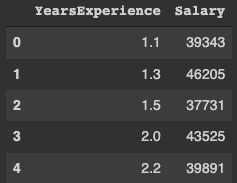
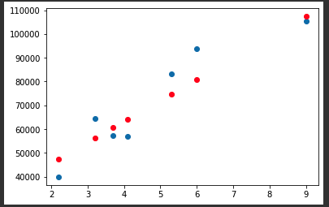

# 머신러닝 1주차 Homework
___

> **❓** 문제
>
>[연차-연봉 데이터셋](https://www.kaggle.com/rsadiq/salary)으로 선형회귀(Linear regression) 모델 구현하기   
>
> ❗️ Hint   
> Learning rate(lr)를 바꾸면서 실험   
> Optimizer를 바꾸면서 실험   
> 손실함수(loss)를 mean_absolute_error로 바꿔서 실험   

## 1. 나의 캐글 정보 세팅하기
나의 캐글 정보를 세팅을 해야 [캐글](https://www.kaggle.com/)에서 원하는 데이터셋을 다운 받을 수 있다.
```python
import os
os.environ['KAGGLE_USERNAME'] = 'my name' 
os.environ['KAGGLE_KEY'] = 'my key' 
```

## 2. Dataset 다운로드
원하는 데이터셋을 다운 받은 후 압축을 풀어준다. Colab에서 맨 앞에 `!`를 붙여주면 리눅스 명령을 할 수 있다.
```python
!kaggle datasets download -d rsadiq/salary
!unzip /content/salary.zip
```

## 3. 필요한 라이브러리 import
* tensorflow & keras
> [TensorFlow](https://www.tensorflow.org/) is an end-to-end open source platform for machine learning.     
> 
> [Keras](https://keras.io/about/) is a deep learning API written in Python, running on top of the machine learning platform TensorFlow
`Tensoflow`는 머신러닝을 위한 오픈소스 플랫폼. `Keras`는 Tensoflow에서 실행되는 파이썬으로 씌여진 딥러닝 API.
<br><br>   

* numpy
> The fundamental package for scientific computing with Python   
> 출처: https://numpy.org/
`Numpy`는 파이썬으로 과학적 계산을 위한 기초적 패키지(라이브러리). 다차원 행렬, 수치 계산 도구 등을 제공.
<br><br>

* pandas
> [pandas](https://pandas.pydata.org/) is a fast, powerful, flexible and easy to use open source data analysis and manipulation tool, built on top of the Python programming language.   
`Pandas`는 오픈소스 데이터 분석 및 조작 도구.
<br><br>

* matplotlib
> [Matplotlib](https://matplotlib.org/) is a comprehensive library for creating static, animated, and interactive visualizations in Python.   
`Matplotlib`은 파이썬에서 시각화를 만들어주는 라이브러리.
<br><br>

* seaborn
> [Seaborn](https://seaborn.pydata.org/) is a Python data visualization library based on matplotlib.   
`Seaborn` 역시 `matplotlib` 기반 파이썬 데이터 시각화 라이브러리.
<br><br>

* sklearn
> Simple and efficient tools for predictive data analysis   
> 출처: https://scikit-learn.org/stable/
`sklearn`은 예측 데이터 분석을 위한 단순하고 효율적인 도구.

```python
from tensorflow.keras.models import Sequential
from tensorflow.keras.layers import Dense
from tensorflow.keras.optimizers import Adam, SGD
import numpy as np
import pandas as pd
import matplotlib.pyplot as plt 
import seaborn as sns
from sklearn.model_selection import train_test_split
```

## 4. 어떤 데이터셋 인가?
pandas 를 이용하여 1번째~5번째 데이터 출력
```python
df = pd.read_csv('Salary.csv')
df.head(5)
```


## 5. 데이터셋의 형태는?
행 35, 열 2 (YearsExperience, Salary) 의 형태 - 총 35개의 데이터
```python
print(df.shape) # (35, 2)
```

## 6. 데이터셋을 그래프로도 출력해보자
선형(Linear)적인 모습이다!
```python
sns.pairplot(df, x_vars=['YearsExperience'], y_vars=['Salary'], height=4)
```


## 7. 데이터를 가공하자
연차(YearsExperience)와 임금(Salary)를 각 input, output으로 분리 후 numpy행렬(2차원)로 변환.
```python
x_data = np.array(df[['YearsExperience']], dtype=np.float32)
y_data = np.array(df['Salary'], dtype=np.float32)
print(x_data.shape) # (35, 1)
print(y_data.shape) # (35,)

x_data = x_data.reshape((-1, 1))
y_data = y_data.reshape((-1, 1))
print(x_data.shape) # (35, 1)
print(y_data.shape) # (35, 1)
```

## 8. 트레이닝데이터(Training dataset)와 검증데이터(Validation dataset)로 분리
총 데이터셋에서   
트레이닝데이터셋(x_train, y_train): 80%   
검증데이터셋(x_val, y_val): 20%    
로 나눈다.
```python
x_train, x_val, y_train, y_val = train_test_split(x_data, y_data, test_size=0.2, random_state=2021)
print(x_train.shape, x_val.shape) # (28, 1) (7, 1)
print(y_train.shape, y_val.shape) # (28, 1) (7, 1)
```
## 9. 선형 회귀(Linear Regression) 모델을 만들자
1. Sequential(순차적) 모델을 만든다. 이 모델은 각 레이어(layer)에 한 입력 tensor, 한 출력 tensor로 이루어져야 적합한 모델이라 되어 있다([참고](https://keras.io/guides/sequential_model/)). 우리는 x_data와 y_data로 이루어져 있다.
2. 모델 옵션 설정 - 손실함수(mean_squared_error), optimizer(Adam)와 Learning rate(lr).
3. 학습시키자 (model.fit)
```python
model = Sequential([
  Dense(1)
])

model.compile(loss='mean_squared_error', optimizer=Adam(lr=2300))

model.fit(
    x_train, # input (training dataset)
    y_train, # output (training dataset)
    validation_data=(x_val, y_val), # 검증 데이터를 넣어주면 한 epoch이 끝날때마다 자동으로 검증
    epochs=100 # epochs 복수형으로 쓰기! 학습 횟수
)
```

## 10. 모델 검증
검증데이터로 설계한 모델이 맞게 잘 예측하는 지 확인해보자. loss가 있긴하지만, 파란점(검증값)과 빨간점(예측값)에 거리 차이가 크지 않다!
```python
y_pred = model.predict(x_val)

plt.scatter(x_val, y_val)
plt.scatter(x_val, y_pred, color='r')
plt.show()
```


## 11. 추가
최적의 모델을 찾기 위해서 우리는 여러가지룰 조정 해 볼수 있겠다. (가진 데이터가 위와 동일 할 때)   
* loss함수를 mean_absolute_error로 변경 후 실험
* optimizer를 변경 (SGD 등)
* lr 수치를 변경
* epochs 수치를 변경

# 총평
___
모든 게 낯선 첫 머신러닝 실습이었다. 강의 자료도 다시보고, 각 라이브러리 다큐먼트도 보고, 팀원들이랑 토론도 해보고, 이렇게 저렇게 만져보기도 하면서 어느 정도는 이해했다. (90% 정도? 맞나..)   
좋은 가설과 좋은 손실 함수를 만들어서 기계가 잘 학습하도록 하는 것이 머신러닝 엔지니어의 핵심 역할이라고 한다. 나는 아직 어떻게 나의 길을 나아가야 할 지 모르겠지만, 관련 기술들을 잘 습득해야겠다! 
수치를 이것저것 바꾸면서 loss를 확인하는 과정이 마치 `과학자`가 된 기분이다.<br><br>

<br><br>당분간은 게더타운에서 흰 가운 입고 있어야겠다~

```toc
```