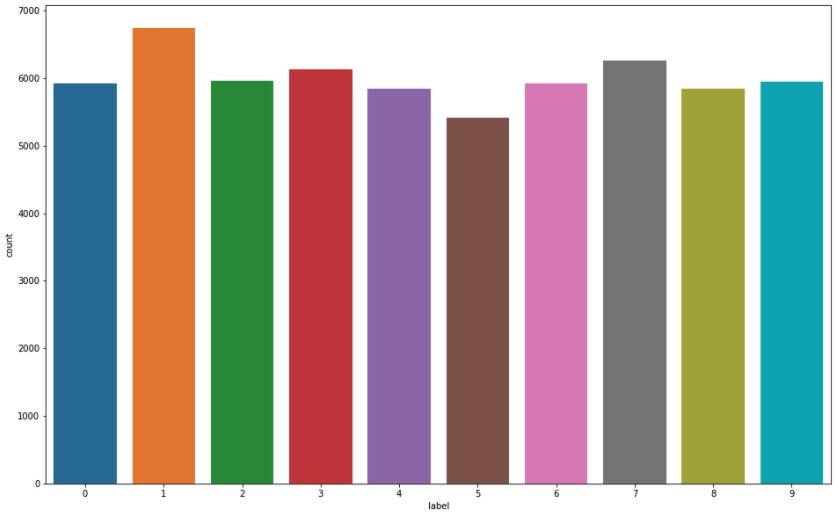
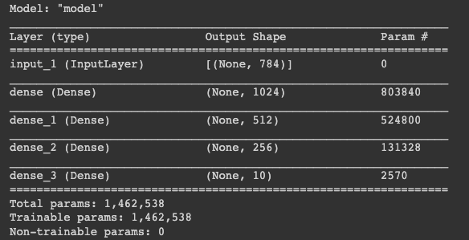
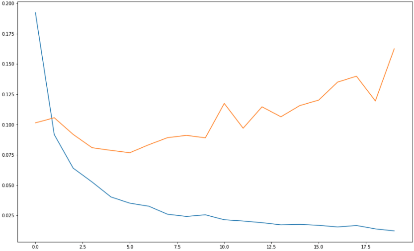
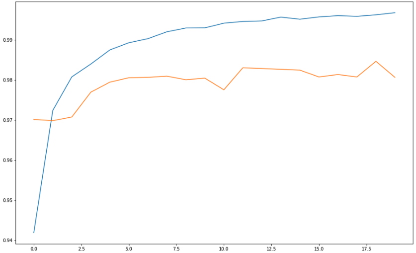

# 머신러닝 3주차 Homework
___

> **❓** 문제
>
> 손으로 쓴 [0~9 숫자 이미지 데이터셋](https://www.kaggle.com/oddrationale/mnist-in-csv)으로 딥러닝(Depp Laerning) 모델 구현하기 

## 1. 필요한 데이터셋 다운 및 패키지 import
```python
import os
os.environ['KAGGLE_USERNAME'] = 'username'
os.environ['KAGGLE_KEY'] = 'key' 
```
```python
!kaggle datasets download -d oddrationale/mnist-in-csv
```
```python
!unzip mnist-in-csv.zip
```
```python
from tensorflow.keras.models import Model
from tensorflow.keras.layers import Input, Dense
from tensorflow.keras.optimizers import Adam, SGD
import numpy as np
import pandas as pd
import matplotlib.pyplot as plt
import seaborn as sns
from sklearn.model_selection import train_test_split
from sklearn.preprocessing import StandardScaler
from sklearn.preprocessing import OneHotEncoder
```

## 2. 트레이닝 & 검증 데이터셋 Dataframe 만들어주기
```python
train_df = pd.read_csv('mnist_train.csv')
train_df.head() # 데이터 5행까지 확인
```
```python
test_df = pd.read_csv('mnist_test.csv')
test_df.head()# 데이터 5행까지 확인
```

## 3. 트레이닝 데이터셋 Output 결과값(숫자별) 갯수 확인
```python
plt.figure(figsize=(16, 10))
sns.countplot(train_df['label'])
plt.show()
```


## 4. 트레이닝 & 검증 데이터셋 입력값과 출력값 분리
```python
train_df = train_df.astype(np.float32)
x_train = train_df.drop(columns=['label'], axis=1).values
y_train = train_df[['label']].values

test_df = test_df.astype(np.float32)
x_test = test_df.drop(columns=['label'], axis=1).values
y_test = test_df[['label']].values

print(x_train.shape, y_train.shape) # (60000, 784) (60000, 1) 6만개의 트레이닝데이터셋
print(x_test.shape, y_test.shape) # (10000, 784) (10000, 1) 1만개의 검증데이터셋
```

## 5. 트레이닝셋의 데이터를 이미지로 출력 해보자
이거 너무 신기하다! 한 데이터씩 784개(28 x 28)의 픽셀 컬러값을 가지고 있다. 요걸 matplotlib 을 이용해 그려주면 위와 같이 숫자가 보인다. 즉, 숫자 이미지 -> 각 픽셀의 컬러 값으로 데이터화. 이미지를 데이터화 한 것도 또 그 데이터를 간단한 함수로 이미지를 볼수 있는 게 정말 신기하다.
```python
index = 3
plt.title(str(y_train[index]))
plt.imshow(x_train[index].reshape((28, 28)), cmap='gray')
plt.show()
```


## 6. 출력값(0~9)을 One-hot encoding 데이터로 변환
컴퓨터가 좋아하는 0과1로 이루어진 벡터로 데이터를 구별해준다.   
0 -> [1, 0, 0, 0, 0, 0, 0, 0, 0, 0]   
1 -> [0, 1, 0, 0, 0, 0, 0, 0, 0, 0]   
(생략)   
8 -> [0, 1, 0, 0, 0, 0, 0, 0, 1, 0]   
9 -> [0, 1, 0, 0, 0, 0, 0, 0, 0, 1]
```python
encoder = OneHotEncoder()
y_train = encoder.fit_transform(y_train).toarray()
y_test = encoder.fit_transform(y_test).toarray()
```

## 7. 입력값을 정규화(Normalization) 한다.
이미지 데이터는 픽셀이 0-255(uint8)로 되어 있음. 255로 나누어 0-1 사이의 소수점 데이터(float32)로 바꾸고 일반화
```python
x_train = x_train / 255.
x_test = x_test / 255.
```

## 8. 모델 구현
```python
input = Input(shape=(784,)) # 784개의 input
hidden = Dense(1024, activation='relu')(input) # 1024 hidden layers + relu(activation function)
hidden = Dense(512, activation='relu')(hidden) # 512 hidden layers + relu(activation function)
hidden = Dense(256, activation='relu')(hidden) # 256 hidden layers + relu(activation function)
output = Dense(10, activation='softmax')(hidden) # 10개의 output + softmax

model = Model(inputs=input, outputs=output)

model.compile(loss='categorical_crossentropy', optimizer=Adam(lr=0.001), metrics=['acc'])

model.summary()
```


## 9. 학습
데이터와 학습량이 많기 때문에 colab GPU를 켜자!
```python
history = model.fit(
    x_train,
    y_train,
    validation_data=(x_test, y_test), # 검증 데이터를 넣어주면 한 epoch이 끝날때마다 자동으로 검증
    epochs=20 # epochs 복수형으로 쓰기!
)
```

## 10. 학습 결과 그래프
* 파란색: 트레이닝데이터셋 로스 / 주황색: 검증데이터셋 로스
* 검증 데이터셋의 로스는 0으로 가다가 점점 상승 곡선으로 그리는 것으로 보아 `overfitting`의 모습을 띤다.
```python
plt.figure(figsize=(16, 10))
plt.plot(history.history['loss'])
plt.plot(history.history['val_loss'])
```

* 파란색: 트레이닝데이터셋 정확도 / 주황색: 검증데이터셋 정확도
* 거의 100에 가까운 굉장히 높은 정확도를 보여준다
```python
plt.figure(figsize=(16, 10))
plt.plot(history.history['acc'])
plt.plot(history.history['val_acc'])
```


## 총평
* 말로만 듣던 tensorflow, pandas, numpy 등의 패키지를 사용해서 딥러닝 모델을 만들어보다니 재미있는 숙제였다:)
* 위와 같은 모델을 학습시킬 때 epoch이 20 정도인데도 시간이 상당히 소요된다. 한 epoch당 10초 정도 걸리는 것 같다.
* 이론에 대해서는 그렇게 깊게 알고 있지 못하는데, 이 정도만 알아도 되는건지 모르겠다.
* 다음주 새프로젝트 들어갈 때 사물인식 기술을 적용한 프로젝트라는 이야기가 있는데, 어떤 프로젝트일지 감이 안 온다.
```toc
```