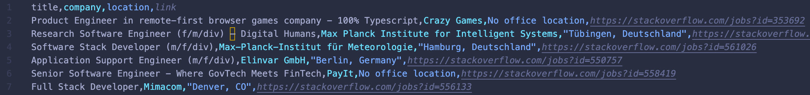

# Job리스트 스크래핑 - 2

## 1. csv 파일로 저장

- csv 모듈을 import 한다
- file 열기(파일명, 쓰기모드) 후 csv.writer에 매개변수로 넣어준다.
- writer로 첫번째 줄에 Title, Company, Location, Link 를 쓴다. (Table header)
- 헤더의 순서대로 값을 리스트화 하여 한줄 한줄 쓴다.

```python
import csv

def save_to_file(jobs):
    file = open("jobs.csv", mode="w")
    writer = csv.writer(file)
    writer.writerow(["Title", "Company", "Location", "Link"])
    for job in jobs:
        writer.writerow(list(job.values()))
    return
```

아래와 같이 csv 파일이 생성 된다.


## 2. csv 파일 다운로드

- `/export?word=python` 이러한 url로 요청이 오면 아래 export함수가 실행된다. (버튼 or a태그를 통해)
- Query string에서 얻은 값으로 저장되어 있는 job리스트를 불어 온다. (실제 디비는 아니고 스크래핑된 데이터가 검색어가 키값인 딕셔너리로 저장되어 있음)
- Query string값이 약속된 키값으로 받지 못하거나 디비에 해당 키값이 없을 경우 / (루트) url로 보낸다.
- 디비에 Query string 값이 있다면 해당 job리스트를 csv파일로 저장한다.
- 그 후 `send_file`(Flask method!!)을 리턴하여 사용자가 브라우저에서 csv파일을 다운로드 받게 한다.

```python
@app.route("/export")
def export():
    try:
        word = request.args.get('word')
        if not word:
            raise Exception()
        word = word.lower()
        jobs = db.get(word)
        if not jobs:
            raise Exception()
        save_to_file(jobs)
        return send_file("jobs.csv")
    except:
        return redirect("/")
```

## 3. CSS로 job리스트 이쁘게 보여주기

- `display: grid` 선언 후, 4개 그리드 셀의 크기를 일정하게(1 fraction) 해준다 `grid-template-columns: repeat(4, 1fr)`

```html
<!DOCTYPE html>
<html lang="en">
  <head>
    <meta charset="UTF-8" />
    <meta http-equiv="X-UA-Compatible" content="IE=edge" />
    <meta name="viewport" content="width=device-width, initial-scale=1.0" />
    <title>Job Search</title>
    <style>
      section {
        display: grid;
        gap: 20px;
        grid-template-columns: repeat(4, 1fr);
      }
    </style>
  </head>
  <body>
    <h1>Search Results</h1>
    <h3>Found {{resultNumber}} results for: {{searchingBy}}</h3>
    <a href="/export?word={{searchingBy}}">Export to CSV</a>
    <section>
      <h4>Title</h4>
      <h4>Company</h4>
      <h4>Location</h4>
      <h4>Link</h4>
      
      <span>{{job.title}}</span>
      <span>{{job.company}}</span>
      <span>{{job.location}}</span>
      <a href="{{job.apply_link}}" target="_blank">Apply</a>
      
    </section>
  </body>
</html>
```

## 총평

- 강의만 듣는 것보다 구현하면서 배우는 게 재밌다.
- 파이썬이 제공하는 기본모듈이 강력하다. (csv파일이 뚝딱 만들어짐)
- 경량화된 web framework Flask도 쉽게 서버를 구현할 수 있도록 제공되는 함수들이 제법 있는 듯하다. (send_file = 파일다운로드)

```toc

```
