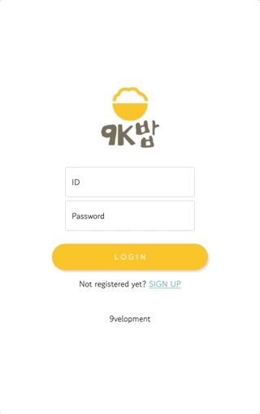
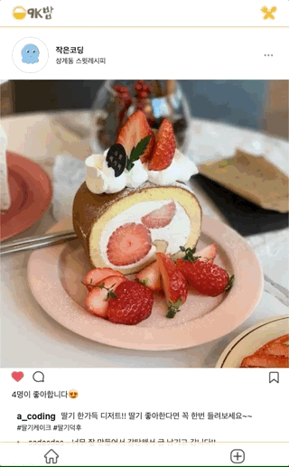
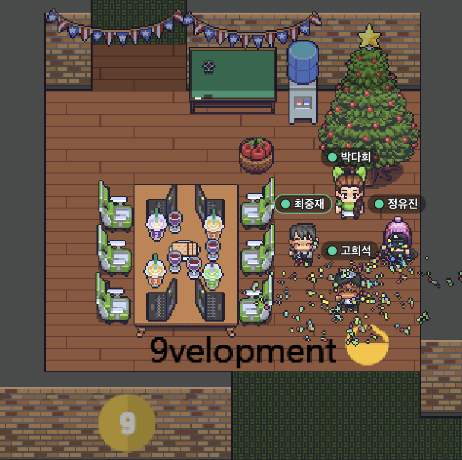
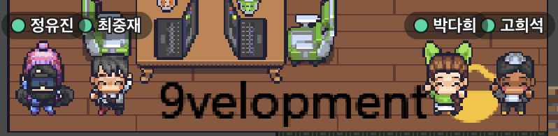

## 1. 9velopment의 두번째(마지막) 팀프로젝트를 마쳤다.🥺
기존 1차 때 만든 [`9k밥`](https://github.com/joong8812/9kbab)을 업그레이드 하는 방향으로 진행하기로 했고, 또 이미 한 번 합을 맞춰 보았기 때문에 프로젝트 시작하기가 이전보다 훨씬 수월했다. 아래 구현 요구사항을 포함시켜 진행했다.
1. Flask / Tensorflow 를 사용해주세요.
2. CNN / 전이학습 등을 활용해주세요.
3. 팀에서 자유롭게 이미지 데이터 및 카테고리를 선정하여, 이미지 분류 모델을 만들어주세요. (ex. 강아지/고양이 분류, 사람/동물 분류, 풍경 분류 등)
4. 웹 상에서 사용자가 이미지를 올리면, 해당 이미지가 어떤 카테고리에 속하는지 재치있게 결과를 출력해주는 서비스를 만드시면 됩니다! (ex. 특정 스포츠 사진을 넣으면, 어떤 스포츠인지를 분류해주는 서비스 등)

### 1-1. 결과물 🕶
1. 숫자 이미지 인식 모델(Neural Network)
   - 신경망 네트워크 모델에 MNIST(숫자 손글씨 이미지) 데이터를 학습 시켜 Captcha 구현   
   - `98.19%` 정확도
     - train_data_set: 60,000 개
     - test_data_set: 10,000 개
   
___
2. 좋아요 기능 구현
   
___
3. 댓글 기능 구현
   
___
4. 음식 사진 인식 모델(InceptionV3)
    - InceptionV3 모델을 바탕으로 82개의 라벨을 가진 음식 사진을 학습 시켜 자동 추천 태그 구현
    - `82.57%` 정확도
      - train_data_set: 70,547 개
      - test_data_set: 12,521 개
   
___
5. 스크랩 기능 구현
   
___
## 2. 9K밥 2차 프로젝트 KPT 회고록 ✍️
* K (Keep) 잘하고 있는점. 계속 했으면 좋겠다 싶은 점
* P (Problem) 뭔가 문제가 있다 싶은 점. 변화가 필요한 점
* T (Try) 잘하고 있는 것을 더 잘하기 위해서, 문제가 있는 점을 해결하기 위해서 우리가 시도해 볼 것들

- **Keep**
    * 업무 분담이 잘 됐다
    * 목표 한 바를 다 이루었다.
    * Github project기능 사용 좋았다.
    * 기존 프로젝트에서 업그레이드 하여 완성도를 높여서 좋았다.
    * 실시간 피드백 좋다
    * 원래 담당 말고 다른 파트 업무를 줘서 좋았다
    * 좋은 팀원 만난게 정말 감사하다
    * 작업 충돌에도 병합으로 잘 풀어냄
    * 같이 라이브 코딩 해서 좋았다.

- **Problem**
    * 머신러닝 기술을 모든 조원이 사용하지 못한게 아쉽다 
    * 팀장님이 총괄 + 백,프론트 업무도 일부 가져가서 일이 많은듯 보였다.
    * 병합과정이 쉽지않았다.
    * 코랩 프로계정 조원 모두 다 주셨으면 좋겠다

- **Try**
    * 이 팀 그대로 가고 싶다.
    * 좋은 팀 분위기가 계속 이어졌으면 좋겠다.
    * 맡은 담당 외에 파트도 해보고 싶다
    * branch 나눠서 개발 해보고 싶다.

## 3. 총평 ☘️
* 머신러닝 모델을 우리 프로젝트에 접목 시키다니!! 진짜 신기했다. 학습을 시켜 정확도가 높은 모델을 만들고, 그 모델이 실제로 잘 판단하고 옳은 결과를 낼 때 정말 짜릿했다.
* 각기 다른 능력과 성격을 가진 사람들이 만나 한 팀을 이루고 한 어플리케이션을 만든게 정말 감동이다.
* 나는 정말 팀원을 잘 만난 것 같다. 총 3주간 9velopment 분들과 행복했다. 그래서 내일이 아쉽다. (팀 변경)
* 다른 조들의 아이디어가 정말 좋다. 그리고 보여주는 부분에서 신경을 잘 써주니까 실제 서비스하는 어플리케이션 같았다. 다들 열정이 좋다~ 우리 동기들 짱!!

## 추가 - 9velopment 졸사
### 👋 다들 고생 많으셨습니다~ 또 케첩(Catch up)해요!! 👋
* 3주간 머물렀던 공부방 📚 (Feat. 다희님 축캐인증)

* 9velopment + 9k밥 로고 🍲

```toc
```