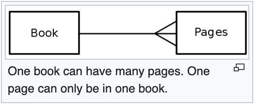
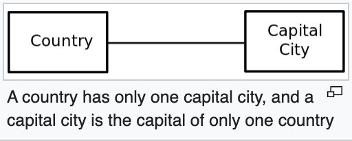
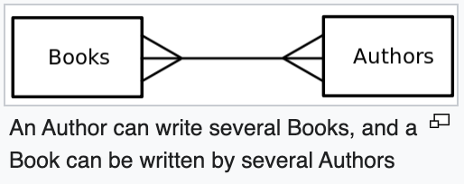
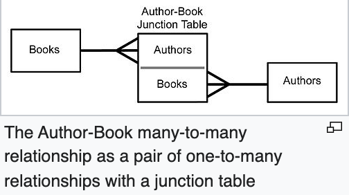

## 데이터베이스 간 관계 👉👈

### 1. One-to-many 📗

우선 위키피디아(Wikipedia) [정의](<https://en.wikipedia.org/wiki/One-to-many_(data_model)>)를 보자.

> In systems analysis, a one-to-many relationship is a type of cardinality that refers to the relationship between two entities (see also entity–relationship model) A and B in which an element of A may be linked to many elements of B, but a member of B is linked to only one element of A. For instance, think of A as books, and B as pages. A book can have many pages, but a page can only be in one book.  
> (쿠니번역🤖 ) 시스템 분석에서 `one-to-many`는 다음과 같은 두 개체간 관계를 나타낸다. A, B 두 개체 중 A의 한 개체는 많은 B의 개체와 연결되어 있고, 반대로 B의 한 개체는 오직 한 A 개체와 연결되어 있다. 예를 들어 A를 여러 책이라 하고 B를 여러 페이지라 하자. 한 책은 여러 페이지를 가질 수 있지만 한 페이지는 한 책 안에만 있을 수 있다.

- 관계도 이미지
  
  출처:https://en.wikipedia.org/wiki/One-to-many_(data_model)

- 장고(Django) 모델에서 One-to-many(1:N) 관계를 살펴보자

```python
class UserModel(AbstractUser):
    class Meta:
        db_table = "my_user"

    bio = models.TextField(max_length=500, blank=True)

class TweetModel(models.Model):
    class Meta:
        db_table = "tweet"
 
    author = models.ForeignKey(UserModel, on_delete=models.CASCADE)
    content = models.CharField(max_length=256)
    created_at = models.DateTimeField(auto_now_add=True)
    updated_at = models.DateTimeField(auto_now=True)
```

TweetModel에서 author가 `models.ForeignKey`로 UserModel을 참조 하고 있다. 이 관계로 한 개의 글에는 한 유저만 있을 수 있고. 반대로 한 유저가 여러개의 글을 작성할 수 있다.

### 2. One-to-one 🧠

위키피디아의 [예시](<https://en.wikipedia.org/wiki/One-to-one_(data_model)>)를 보면서 One-to-one 관계를 이해 해보자.

> For instance, think of A as the set of all human beings, and B as the set of all their brains. Any person from A can and must have only one brain from B, and any human brain in B can and must belong to only one person that is contained in A.  
> (쿠니번역🤖 ) 모든 인류 집단이라는 A와 그들의 뇌 집단을 B 라고 생각 해보자. A 그룹에서 누구든지 B그룹에 오직 한 뇌만 가질 수 있고, B그룹의 어떤 누구의 뇌든지 오직 A그룹의 한 사람에게 속해야한다.

- 관계도 이미지
  
  출처:https://en.wikipedia.org/wiki/One-to-one_(data_model)

- 장고(Django) 모델에서 One-to-one(1:1) 관계를 살펴보자

```python
class User(AbstractUser):
    class Meta:
        db_table = "my_user"

    bio = models.TextField(max_length=500, blank=True)

class Profile(models.Model):
    user = models.OneToOneField(User, on_delete=models.CASCADE)
    user_pk = models.IntegerField(blank=True)
    nickname = models.CharField(max_length=200, blank=True)
    point = models.IntegerField(default=0)
    phone = models.CharField(max_length=200, blank=True)
```

Profile모델에서 user가 `models.OneToOnefield`로 User모델을 값으로 가지고 있다. 이를 통해 User모델과 Profile모델이 1:1 관계를 가진다. 서로 중복을 만들지 않는다. (각 유저에게 각 고유의 프로필이 있습니다!)

### 3. Many-to-many 🍕

위키피디아의 [예시](<https://en.wikipedia.org/wiki/Many-to-many_(data_model)>)를 보면서 Many-to-many 관계를 이해 해보자.

> For example, think of A as Authors, and B as Books. An Author can write several Books, and a Book can be written by several Authors.  
> (쿠니번역🤖 ) 책의 저자들을 A, 책들을 B 라고 생각 해보자. 한 저자가 여러 권의 책을 쓸 수도 있고, 여러 저자들이 한 책을 쓸 수도 있다.

- 관계도 이미지
    
  
  출처: https://en.wikipedia.org/wiki/Many-to-many_(data_model)  
  두 one-to-many 관계를 junction table(연결테이블)에 의해 한 many-to-many 관계를 만들 수 있다.

- 장고(Django) 모델에서 Many-to-many(N:N) 관계를 살펴보자

```python
class MyTopping(models.Model):
    topping_name = models.CharField(max_length=100)

class MyPizza(models.Model):
    pizza_name = models.CharField(max_length=100)
    pizza_topping = models.ManyToManyField(MyTopping)
```

MyPizza모델에서 pizza_topping이 `models.ManyToManyField`로 MyTopping모델과 many-to-many관계가 형성되었다. 한 종류의 토핑은 여러 피자에서 사용될 수 있고, 한 피자는 여러 토핑을 사용할 수 있다.

## 총평 🍍

- 데이터베이스의 3가지 관계를 배울 수 있어 정말 좋았다.
- 장고를 통해 모델(테이블) 간의 관계를 한 줄의 코드로 쉽게 만들 수 있어 정말 신기했다.
- 배운 것을 토대로 애플리케이션을 만들 때 DB설계를 잘 해야겠다.

```toc

```
