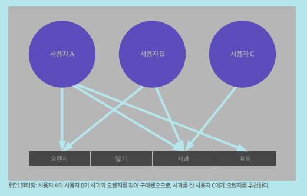
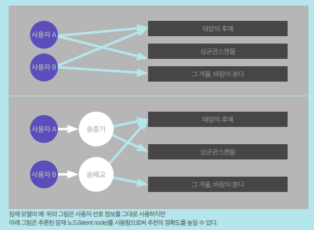

아래는 추천시스템에 대해 알고 싶어 **서울대학교 융합과학기술대학원 서봉원 교수님**의 [`콘텐츠 추천 알고리즘의 진화`](http://www.kocca.kr/insight/vol05/vol05_04.pdf) 라는 글을 읽고 정리 한 것 입니다.
# 추천 시스템

사용자가 선호할 만한 아이템을 추측함으로써 여러 가지 항목 중 사용자에게 적합한 특정 항목을 선택(informaiton filtering)하여 제공하는 시스템.

# 추천 시스템 종류

## 협업 필터링(Collaborative filtering)

대규모의 기존 사용자 행동 정보를 분석하여 해당 사용자와 비슷한 성향의 사용자들이 기존에 좋아했던 항목을 추천하는 기술 - 사용자의 행동 기록을 이용

- 결과가 직관적, 항목의 구체적인 내용을 분석할 필요가 없다는 장점
- 비슷한 패턴을 가진 사용자나 항목을 추출하는 기술이 핵심 - 행렬분해(Matrix Factorization), k-최근접 이웃 알고리즘(k-Nearest Neighbor algorithm;kNN) 등
- 콜드 스타트(Cold Start): `새로 시작할때 곤란함` - 기존의 자료가 필요한 바, 기존에 없던 새로운 항목이 추가되는 경우 추천이 곤란



- 계산량이 비교적 많은 알고리즘, 사용자 수가 많은 경우 효율적으로 추천할 수 없는 단점
- 롱테일(Long tail): 사용자들의 관심이 적은 다수의 항목은 추천을 위한 충분한 정보를 제공 못하는 경우가 발생, 비대칭 쏠림 현상

## 콘텐츠 기반 필터링(Content-based filtering)

항목 자체를 분석하여 추천. 예를 들어 음악을 추천하기 위해 음악 자체를 분석하여 유사한 음악을 추천하는 방식

- 항목을 분석한 프로파일(item profile)과 사용자의 선호도를 추출한 프로파일(user profile)을 추출하여 `이의 유사성` 을 계산
- 콘텐츠의 내용을 분석해야하므로 아이템 분석 알고리즘이 핵심 - 군집분석(Clustering analysis), 인공신경망(Artificial neural network), tf-idf(term frequency-inverse document frequency) 등
- 다양한 형식의 항목을 추천하기 어려운 단점
    - 예를 들어 음악과 사진, 비디오를 동시에 추천해야하는 경우, 각각의 항목에서 얻을 수 있는 정보가 다르기 때문에 프로파일을 구성하기 매우 어려워짐

## 모델 기반 협력 필터링(Model-based Collaborative Filtering algorithm)

기존 항목 간 유사성을 단순하게 비교하는 것에서 벗어나 자료 안에 내재한 패턴을 이용하는 기법

- 방법1. 연관되는 자료의 크기를 동적으로 변화
    - 예) <해리포터2편> 추천을 위해서 <해리포터1편>을 좋아했는가 중요한 요소, 그러나 주토피아를 추천하기 위해서는 많은 수의 유사한 영화를 고려 해야 함.
- 방법2. 잠재모델 - 사용자가 특정 항목을 선호나는 이유를 알고리즘적으로 알아내는 기법
    - 특정 드라마를 좋아하는 이유를 주위 정보(배우, OST, 장르 등)를 이용해 선호 유추
        
        
        
    - 세부적 정보를 유추함으로써 높은 정확도로 항목을 추천할 수 있음
    - 이러한 모델을 만들어내는 데 많은 계산이 필요, 이에 따라 즉각적인 추천이 어려움
    - 내재되어 있는 패턴을 알아내는 것이 핵심 - LDA(Latent Dirichlet Allocation), 베이지안 네트워크(Bayesian Network) 등

## 딥러닝(Deep Learning) 기술에 기반을 둔 알고리즘

스포티파이(Spotify) - 협력 필터링에 딥러닝 기술 적용

구글(Google) - 추천을 위한 텍스트를 자동으로 생성하기 위해 딥러닝 기술 사용

# 필터버블(Filter Bubble)

추천시스템이 고도화될수록 사용자의 입맛에 맞는 정보만 제공되고 나머지 정보는 감추어지는 위험이 생기는 현상

# 총평
* 기술적인 부분은 잘 모르겠지만, 개념적으로 추천시스템이 무엇인지 알아볼 수 있는 시간이었다.
* 내일 새로운 프로젝트 발제 전에 추천시스템 강의가 있는데, 어느 정도를 배울 수 있고, 또 얼마나 프로젝트에 적용해 볼 수 있을지 기대가 된다.

```toc
```