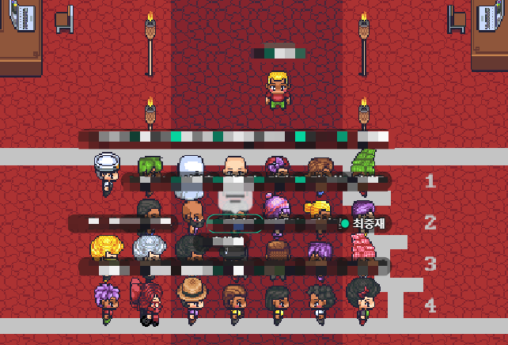

## 환경설정 하다가 시간 다 갔다
오늘 오전 강의에서 `NST(Neural Style Transfer)`를 장고에서 어떻게 붙일 수 있는 배웠다. 모델 자체는 `Tensorflow_hub`에서 사용하고 우리는 입력값(이미지)을 잘 가공만 해주면 된다. `Django Ninja`를 사용하여 API서버는 뚝딱 만들었는데 이를 `EB(AWS ElasticBeanstalk)`에 올리는 것은 쉽지 않았다. eb-cli를 통해 배포 하려 했는데 이게 쉽지 않았다. 설치를 하면 virtualenv 에러가 났고, 잘 설치했더니 eb-cli에서 올릴 때 environment에러가 났다. 처음 문제는 에러메시지대로 virtualenv 설치해서 해결했다. 그런데 2번째는 aws 정책관련 된 것이였는데, 에러메시지를 구글링해도 쉽게 해결하기가 어려웠다. 결론은 eb-cli 설정된 IAM이 eb-cli로 배포할수 있는 권한이 잆었던 것 같다. 그래서 나는 새로 모든 권한을 가진 IAM을 만들고 eb-cli에 설정해주니 잘 됐다. 글로 작성하면 몇자 안되지만, 저걸로 어제 오후를 다 보냈다. 하아. 그래도 다행인건 이것을 하는 과정에서 AWS 정책과 eb-cli 설정 등을 알게되어서 함께 공부하는 한 캠퍼분을 도울 수 있었다. 이것은 뿌듯한 부분이다. `배워서 남주자~~`

## 스파르타 내배캠(내일배움캠프) MM(Mingle Monday)
오늘 스파르타 내배캠 운영진에서 이벤트를 열어주었다. 편의점 상품권을 줘서 먹고 싶은 다과를 무려 공짜로 살 수 있었고 이벤트 내내 재밌게 먹으면서 할 수 있었다. `게더타운`에서 여러 문제도 풀고 달리기 시합도 하고 1시간 정도 재밌는 시간을 보냈다. 문제 잘 푼 사람들은 선물도 줬다. (나는 한 문제도 못 풀었다 ㅎㅎ). 공부하느라 다들 힘들고 지쳐있을텐데 이런 시간이 마련되서 기분전환도 되고 좋았던 것 같다. 내일부터 새로운 팀프로젝트 열심히 해야지 아자!   

계주 달리기 한 장면 찰칵📸 내가 우리 조 첫번째 주자 였다. 왕부담🥲 (결과는 뒤에서 2번째?? ㅎㅎ)