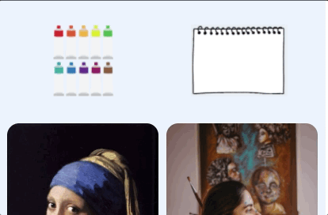

## gif가 무엇이길래...
이번 프로젝트에서 프론트를 맡는다고 했을 때, 다른 여러가지 요소들도 중요하지만 인터렉티브한 요소를 조금이라도 가미 시키고 싶었다. 우선 메인 페이지를 담당해서 작업하고 있는데 유화작업페이지 랑 마이페이지로 가는 버튼을 마우스오버 하면 어느 곳으로 가게 되는지 사용자에게 보여주고 싶었다. 이를 하기 위해서 처음에는 일반 png 버튼을 배치하고 마우스 오버가 되면 제작된 gif파일을 보게 하면 되겠다고 생각했다. 그런데 이 gif만드는 과정이 싶지가 않았다. 기존에 배치된 이미지파일과 크기도 동일하게 된 상태에서 글씨가 쓰여지는 효과만 보이고 싶었는데 이런 디자인 작업은 내가 잘 몰라서 엄청 애를 먹었다. 결국 해내기는 했는데 여전히 만족스럽지는 않다. 그냥 오늘 하루종일 아이패드로 글씨쓰고 캡처해서 gif만들고 리사이즈,속도 조절 등 여러개를 만들었다가 바꾸었다가 아주 난리가 났었다. 생각만큼 잘 안되서 머리를 쥐어뜯으면서 했는데 이를 보고 느낀게 생각대로 잘안되고 시간이 흘러도 조금 침착한 마음을 갖고 잘했으면 좋겠다.(결과에 비해 시간을 너무 소비해서 더 그랬던 것 같다) 너무 스트레스 받으면서 한 스스로에게 너무 미안하다.

## 결과물

```toc
```