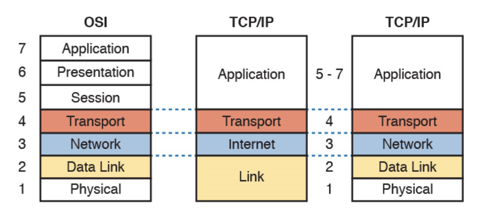

## OSI 7 계층
### 정의 및 특징
* OSI 7 계층은 Open System Interconnection 참조 모델로 국제 표준화 기구(ISO)에서 제안한 통신 규약이다.
  * 다른 네트워크 망 끼리 통신하기 위해서 표준을 만들었다.
* 전송할 데이터가 계층을 지나면서 통신을 위한 데이터(헤더)가 추가되어 전송된다.
* 각 계층이 하는 일이 명확하여 오류의 추적과 상태관리가 쉬워진다.
* 실제 인터넷에서 사용되는 TCP/IP 계층은 OSI 참조 모델을 기반으로 만들어짐
### 구조

출처: [100-105 ICND1 Video Series: 1.1 Compare and contrast OSI and TCP/IP models: Part 2](https://certwhiz.com/2016/06/26/100-105-incd1-video-series-1-1-compare-and-contrast-osi-and-tcpip-models-part-2/)   
OSI는 7 계층을 제안했지만, 실제 우리가 사용하는 인터넷은 TCP/IP 계층을 사용하며 4 계층(original)이었지만 지금은 5 계층(updated)으로 나누어 사용 중이다.
### Layer (계층)
1. Physical (물리)
- 통신을 수행하는 두 장치 간의 실제 접속 담당 
- 0101 이진 데이터를 물리적 신호로 인코딩(송신)/디코딩(수신)
- Ethernet cable, fibre, wireless, coax, etc...
- 관련 장비: 리피터, 허브
- 프로토콜 데이터 단위: 비트(Bit)

2. Data Link (데이터 링크)
- 시스템간의 연결 설정으로 두 장치간의 속도 차이를 위한 흐름 제어, 오류 제어
- 데이터의 처음과 끝을 구별 하여 인코딩/디코딩
- MAC Address
- 관련 장비: 랜카드, 브리지, 스위치
- 프로토콜 데이터 단위: 프레임(Frame)

3. Network (네트워크)
- 네트워크 연결을 관리하는 기능과 데이터 교환 및 중계
- 데이터에 IP주소를 더하여 인코딩/디코딩
- IPv4, IPv6
- 관련 장비: 라우터
- 프로토콜 데이터 단위: 패킷(Packet)

4. Transport (전송)
- End To End, 종단간 데이터를 전송하는 역할로 상위 계층과 하위 계층의 인터페이스
- 해당 프로세스에 명확하게 전달하기 위하여 포트를 더하여 인코딩/디코딩
- TCP/UDP
- 관련 장비: 게이트웨이
- 프로토콜 데이터 단위: 세그먼트(Segment)

5. Session (세션)
- 송, 수신 측 간의 관련성을 유지하고 대화를 제어
- 프로토콜 데이터 단위: 메시지

6. Presentation (표현)
- 세션 계층으로 받은 데이터를 응용 계층에 맞게 변환, 응용 계층으로 부터 받은 데이터를 세션 계층으로 맞게 변환
- 프로토콜 데이터 단위: 메시지

7. Application (응용)
- 사용자가 OSI 환경에 접근할 수 있도록 세비스를 제공, 응용 터미널, 파일 전송 등등
- 데이터가 프로토콜 구조에 따라 담겨져 인코딩/디코딩 `http 예) 데이터가 header, body, request, response, status code 등과 함께 구성됨`
- HTTP, HTTPS, DHCP, DNS, FTP, POP, SMTP, SSH, etc...
- 프로토콜 데이터 단위: 메시지
  
### 

## 참고
* [[네트워크] OSI 7 계층 (OSI 7 LAYER) 기본 개념, 각 계층 설명](https://reakwon.tistory.com/59?category=300675)
* [OSI 7 계층이란?, OSI 7 계층을 나눈 이유](https://shlee0882.tistory.com/110)
* [[Network] OSI 7 Layers와 TCP / IP 구조 비교](https://wonit.tistory.com/496)
* [OSI 7 계층과 TCP/IP 계층](https://velog.io/@inyong_pang/OSI-7-%EA%B3%84%EC%B8%B5%EA%B3%BC-TCPIP-%EA%B3%84%EC%B8%B5#1%EA%B3%84%EC%B8%B5----%EB%AC%BC%EB%A6%AC-%EA%B3%84%EC%B8%B5physical-layer)
* [OSI Model](https://www.imperva.com/learn/application-security/osi-model/)
* [[10분 테코톡] 🔮 히히의 OSI 7 Layer](https://www.youtube.com/watch?v=1pfTxp25MA8)

```toc
```