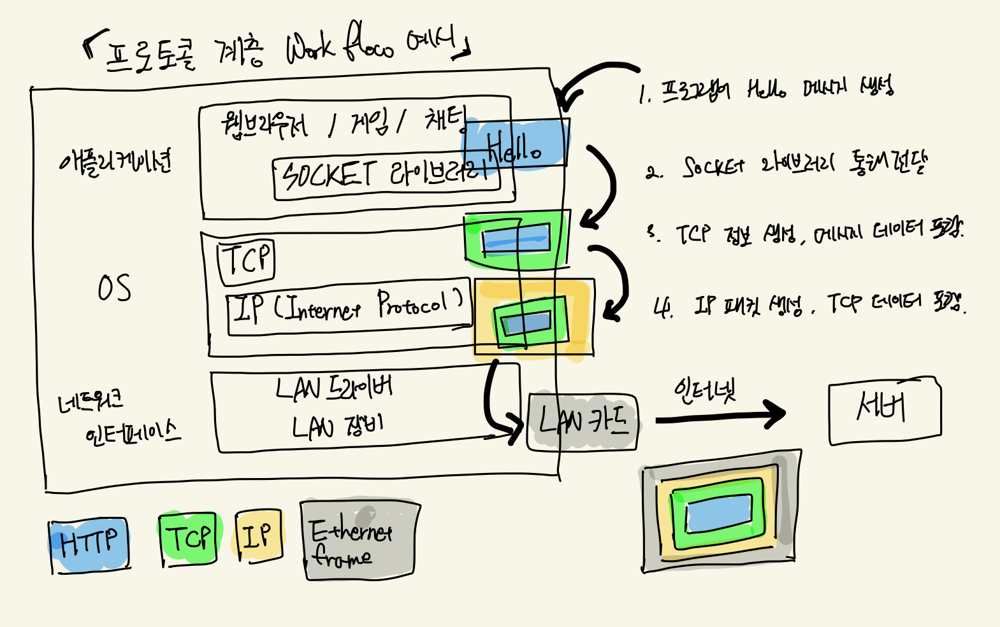

## TCP와 UDP

### 개요

우리가 현재 사용하고 있는 인터넷은 TCP/IP모델을 따르고 있다. 아래 흐름도를 보고 어떻게 통신이 이루어지는 지 파악하고 이후에는 전송계층에서 쓰이는 TCP와 UDP의 특징과 차이를 보자.

### TCP/IP 모델의 통신흐름


참고: [모든 개발자를 위한 HTTP 웹 기본 지식](https://www.inflearn.com/course/http-%EC%9B%B9-%EB%84%A4%ED%8A%B8%EC%9B%8C%ED%81%AC) 강의 내용 중 발췌하여 저의 손으로 그려 봄

1. 애플리케이션(Application) 계층에서 보낼 데이터와 함께 `HTTP` 정보 생성
2. 애플리케이션(Application) 계층에서 위 정보를 Sokcket library를 통해 전송(Transport) 계층으로 전달한다
3. 전송(Transport) 계층에서 HTTP 데이터를 포함하여 `TCP` 정보 생성한다
4. 네트워크(Network) 계층에서 TCP 데이터를 포함하여 `IP` 패킷 생성한다
5. 네트워크 인터페이스(Network Interface) 계층에서 LAN카드를 통해, 인터넷을 통해 목적지인 서버에 위 과정을 거친 정보를 전송한다.

### TCP (Transmission Control Protocol, 전송 제어 프로토콜)

- 연결지향 - TCP 3 way handshake, 가상(논리적) 연결

```python
1. Client ----------> Server
             (SYN)

2. Client <---------- Server
           (SYN+ACK)

3. Client ----------> Server
             (ACK)

4. Client ----------> Server
             (DATA)

# 1~3번의 과정(3 way handshake) 과정을 통해서 Client와 Server간의 connection이
# 연결되고 이후 데이터를 전달한다. (요즘은 3,4을 동시에 처리하기도 한다.)
```

- 데이터 전달 보증
  - 데이터 전송(요청) <-----> 데이터 잘 받았음(응답)
  - 데이터를 주고 끝나는 게 아니라 잘 받았음을 응답을 해줘 데이터 전달을 보증할 수 있다.
- 순서 보장
  - Client가 보낸 순서와 다르게 Server가 받을 경우 재전송을 요청한다.
  - Client는 서버 요청대로 재전송 한다.
- 신뢰할 수 있는 프로토콜, 대부분 TCP 사용

### UDP (User Datagram Protocol, 사용자 데이터그램 프로토콜)

- 하얀 도화지에 비유 (기능이 거의 없음)
- 연결지향 - TCP 3 way handshake ❌
- 데이터 전달 보증❌
- 순서보장❌
- 데이터 전달 및 순서가 보장되지 않지만, 단순하고 빠름
- 최근 HTTP/3에서 UDP프로토콜(QUIC) 사용
  - TCP 방식은 데이터 전달 보증 등 장점이 있지만 UDP에 비하면 방식에 있어 Latency(지연시간)가 발생하는 단점이 있다.
  - 각 전송마다 독립적인 스트림 Chain을 만들어 TCP보다 더 빠르고 기존 UDP와 달리 전달이 보증되는 방식이다.

## 마무리

통신이 안전하게 잘 이루어지도록 설계 된 `TCP`와 빠르게 전송할 수 있는 `UDP`의 특징을 잘 활용하여 성능이 향상된 HTTP/3까지 살펴보았다. 이와 같이 어플리케이션 레벨에서도 또 다른 방식으로 성능 향상 및 최적화를 이루어 사용자 경험을 더욱 좋게 만들 수도 있을 것이다. 기존 기술을 잘 활용하는 것도 새로운 문제 풀이에 도움이 될 수 있을 것 같다.

## 참고

- [인프런-모든 개발자를 위한 HTTP 웹 기본 지식](https://www.inflearn.com/course/http-%EC%9B%B9-%EB%84%A4%ED%8A%B8%EC%9B%8C%ED%81%AC)
- [[10분 테코톡] 🎃손너잘의 HTTP1.1, HTTP2, 그리고 QUIC](https://www.youtube.com/watch?v=ZgSC5K1sUYM&list=PLgXGHBqgT2TvpJ_p9L_yZKPifgdBOzdVH&index=50)

```toc

```
